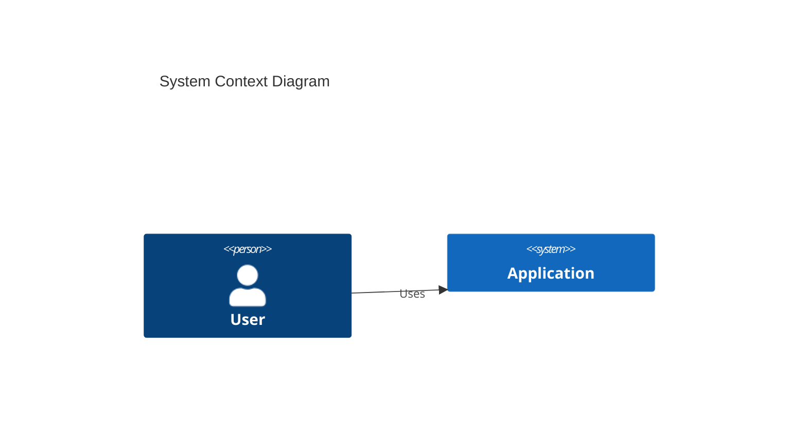

# Contributing to Technical Documentation

Thank you for contributing to our technical documentation repository. This guide will help you create high-quality, traceable documentation.

## Quick Start

### Prerequisites
```bash
make setup  # Install Vale and Mermaid CLI
vale sync   # Download Google Style Guide
```

### Workflow
1. Create a branch: `git checkout -b docs/your-feature-name`
2. Copy the appropriate template from `templates/`
3. Edit and validate: `make lint`
4. Commit and push
5. Create Pull Request

## Documentation Types

### Requirements (Volere)
**When to create:** New business capability, regulatory constraint, or quality attribute.

```bash
cp templates/req-volere.md docs/01-requirements/req-auth-101.md
# Edit file, then validate
make lint
```

**Required fields:**
- Unique ID (REQ-{DOMAIN}-{SEQUENCE})
- Description, Rationale, Source
- Fit Criterion (measurable)
- Satisfied By (link to ADRs)

### Architectural Decision Records (MADR)
**When to create:** Technology choice, architectural pattern, API change, security control.

```bash
cp templates/adr-madr.md docs/03-decisions/adr-0008.md
# Edit file, then validate
make lint
```

**Required fields:**
- Unique ID (ADR-{SEQUENCE})
- implements_requirement: REQ-XXX-YYY (in frontmatter)
- Context, Decision Drivers, Options, Outcome
- Consequences (Positive, Negative, Risks)

### Architecture Specifications (arc42)
**When to create:** New system/service, major component changes, deployment changes.

```bash
cp templates/arch-arc42.md docs/02-architecture/arch-user-service.md
# Edit all 12 sections, then validate
make lint
```

**Required sections:**
- All 12 arc42 sections
- At least one Mermaid C4 diagram
- References to ADRs in Section 9

### API Specifications (OpenAPI)
**When to create:** New endpoint, schema change, authentication change.

**Rule:** OpenAPI MUST be authored BEFORE implementation (API First principle).

```bash
mkdir -p docs/05-api/user-service
vim docs/05-api/user-service/openapi.yaml
spectral lint docs/05-api/user-service/openapi.yaml
```

## The Golden Thread (Traceability)

Every change must maintain the traceability chain:

```
[Requirement] → [ADR] → [Architecture] → [Implementation]
```

### Example
```markdown
# In req-auth-101.md
## Satisfied By
- [ADR-0008](../03-decisions/adr-0008.md)

# In adr-0008.md (frontmatter)
implements_requirement: REQ-AUTH-101

# In arch-user-service.md (Section 5)
**Implements:** [ADR-0008](../03-decisions/adr-0008.md)
```

## Validation Checklist

Before submitting a PR:

- [ ] `make lint` passes with zero errors
- [ ] All relative links are valid
- [ ] YAML frontmatter is complete
- [ ] Diagrams use Mermaid (not images)
- [ ] Traceability links are bidirectional
- [ ] Document has an owner specified

## Writing Guidelines

### Style
- **Voice:** Active voice ("The system authenticates users")
- **Tense:** Present tense for current state
- **Tone:** Professional, precise, no marketing language
- **Audience:** Engineers with domain expertise

### Diagrams
- **Format:** Mermaid only (text-based, version-controllable)
- **Types:** C4 Model (Context, Container, Component), Sequence, Class
- **Placement:** Embed in relevant sections

```markdown

```

### Links
- **Use relative paths:** `../01-requirements/req-auth-101.md`
- **Never absolute URLs:** ~~`https://example.com/docs/req-auth-101.md`~~
- **Bidirectional:** If A links to B, B should acknowledge A

## Common Mistakes

### ❌ Don't Do This
```markdown
# No frontmatter
# No traceability links
# Passive voice: "The user is authenticated by the system"
# Absolute URLs
# Binary images
```

### ✅ Do This
```markdown
---
id: REQ-AUTH-101
status: active
---

# REQ-AUTH-101: Multi-Factor Authentication

The system authenticates administrative users...

## Satisfied By
- [ADR-0008](../03-decisions/adr-0008.md)
```

## Pull Request Process

1. **Title format:** `docs: Add REQ-AUTH-101 for MFA requirement`
2. **Description:** Include traceability matrix
3. **Checks:** Ensure GitHub Actions pass
4. **Review:** Request review from document owner
5. **Merge:** Squash and merge after approval

## Questions?

- Read [SOP-000](docs/00-governance/sop-000-master.md) for traceability
- Check [SOP-004](docs/00-governance/sop-004-api-guidelines.md) for API guidelines
- Review [AI_CONTEXT.md](.github/AI_CONTEXT.md) for decision trees
- Contact: CTO Office or Architecture Guild
