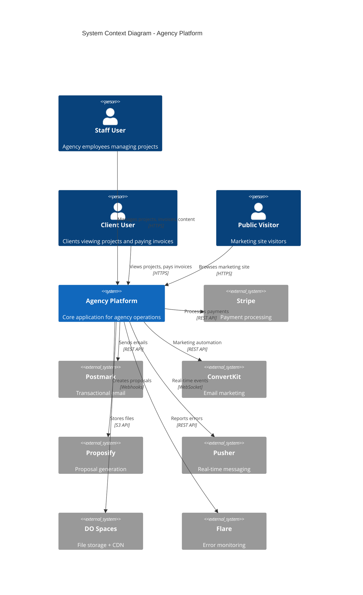
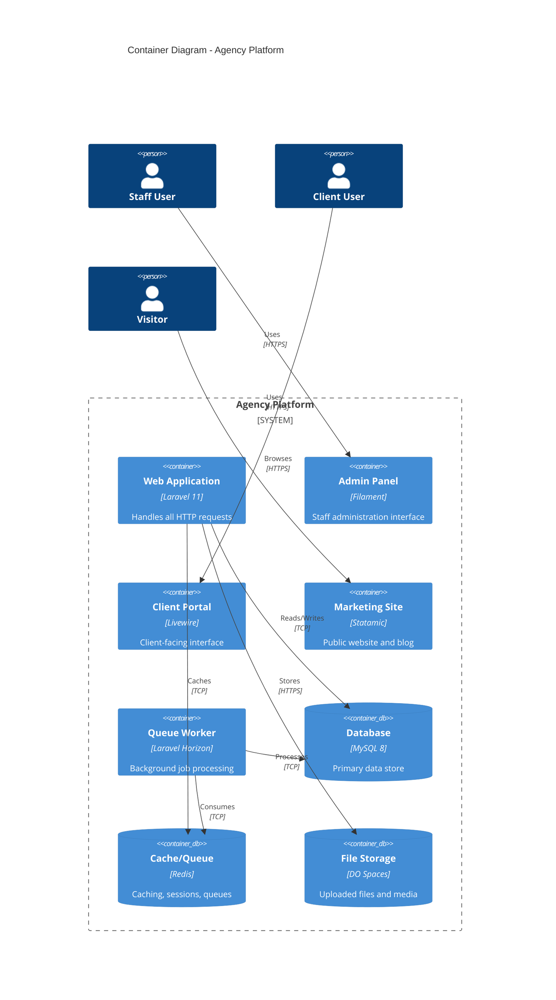
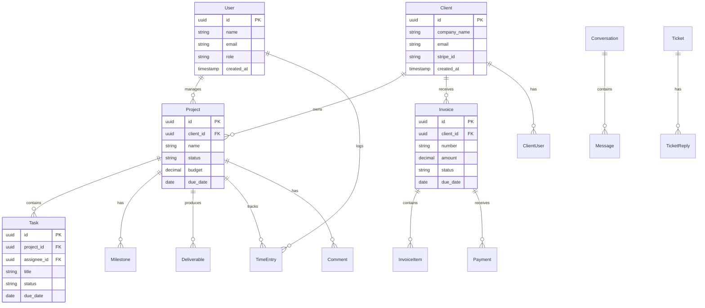
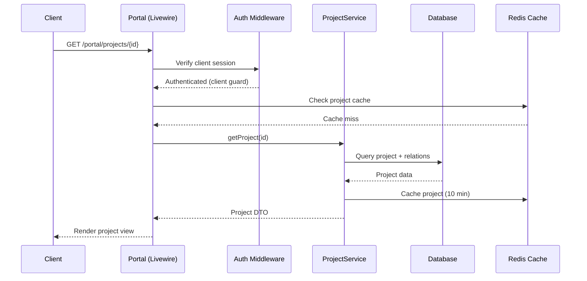
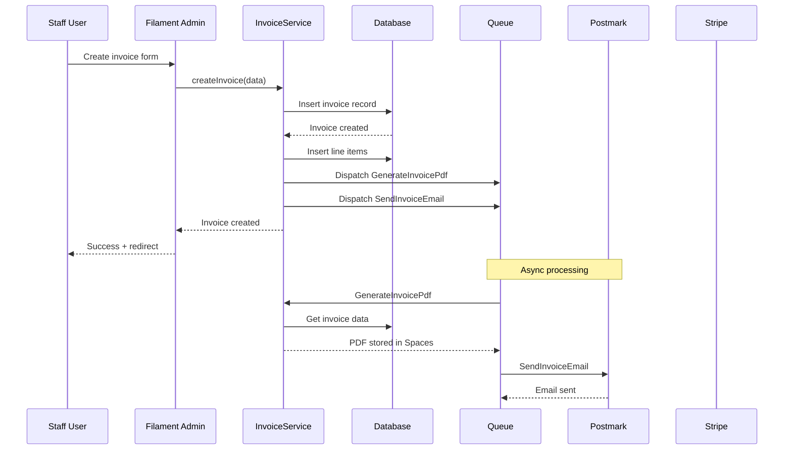
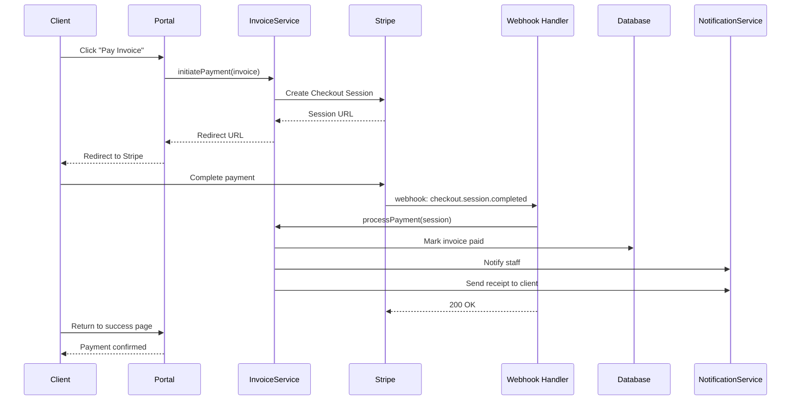
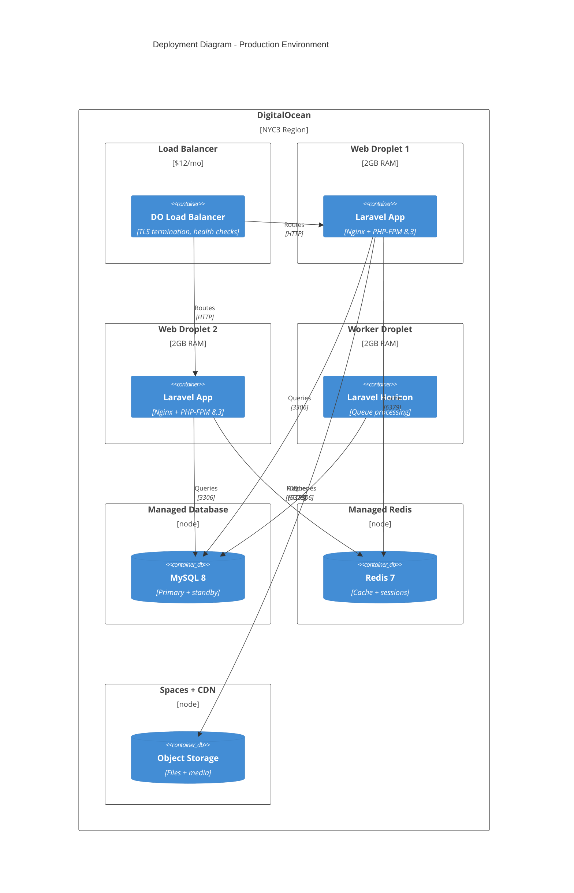
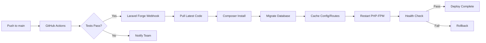
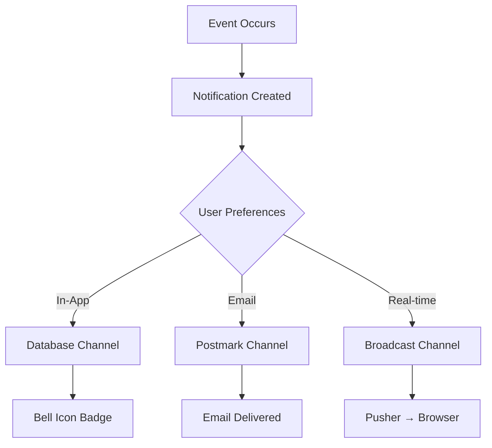

# Architecture Specification: Agency Platform

**Template Version:** arc42 v8.0
**System:** Agency Platform
**Version:** v1.0.0
**Last Updated:** 2025-11-29

---

## 1. Introduction and Goals

### 1.1 Requirements Overview

The Agency Platform is a comprehensive web application for managing agency operations including:

**Core Functionality:**
- Client portal for project visibility, invoicing, and communication
- Staff admin panel for project management, billing, and analytics
- Marketing site with blog, services, and portfolio
- Time tracking, invoicing, and payment processing

**Key Requirements by Domain:**
- **Authentication:** [REQ-AUTH-001](../01-requirements/req-auth-001.md) through [REQ-AUTH-008](../01-requirements/req-auth-008.md)
- **Projects:** [REQ-PROJ-001](../01-requirements/req-proj-001.md) through [REQ-PROJ-010](../01-requirements/req-proj-010.md)
- **Billing:** [REQ-BILL-001](../01-requirements/req-bill-001.md) through [REQ-BILL-009](../01-requirements/req-bill-009.md)
- **Portal:** [REQ-PORT-001](../01-requirements/req-port-001.md) through [REQ-PORT-009](../01-requirements/req-port-009.md)
- **Marketing:** [REQ-MKTG-001](../01-requirements/req-mktg-001.md) through [REQ-MKTG-009](../01-requirements/req-mktg-009.md)

Total: 101 requirements across 13 domains.

### 1.2 Quality Goals

| Priority | Quality Attribute | Specific Goal |
|----------|-------------------|---------------|
| 1 | Performance | Page load < 3 seconds, API response < 500ms (REQ-PERF-001, REQ-PERF-002) |
| 2 | Availability | 99.9% uptime (8.76 hours max downtime/year) (REQ-PERF-003) |
| 3 | Security | Zero high-severity vulnerabilities, GDPR compliant (REQ-SEC-*) |
| 4 | Usability | Client and staff interfaces intuitive, minimal training required |
| 5 | Maintainability | Modular architecture, comprehensive documentation |

### 1.3 Stakeholders

| Role | Expectations |
|------|--------------|
| Agency Owner | Business insights, client management, revenue tracking |
| Project Managers | Task management, time tracking, client communication |
| Developers | Clean codebase, clear documentation, maintainability |
| Clients | Easy access to project status, invoices, deliverables |
| Finance | Invoice management, payment tracking, financial reports |
| Marketing | Content management, lead capture, SEO control |

---

## 2. Architecture Constraints

### 2.1 Technical Constraints

| Constraint | Description | Impact |
|------------|-------------|--------|
| Framework | Laravel 11 with PHP 8.3 | All backend code follows Laravel conventions |
| Frontend | Livewire 3 + Alpine.js | Reactive UI without SPA complexity |
| Database | MySQL 8 (DigitalOcean Managed) | SQL queries, Eloquent ORM |
| Hosting | DigitalOcean + Laravel Forge | Must use DO services (ADR-0011) |
| Payments | Stripe only | Payment processing via Laravel Cashier (ADR-0014) |

### 2.2 Organizational Constraints

| Constraint | Description |
|------------|-------------|
| Budget | Infrastructure < $200/month at launch |
| Buy vs Build | Prefer SaaS for non-core functionality (ADR decisions) |
| Team | Small team, minimize operational overhead |
| Timeline | MVP with critical requirements first |

### 2.3 Conventions

- **API Design:** Follow [SOP-004](../00-governance/sop-004-api-guidelines.md) (Zalando guidelines)
- **Code Style:** PSR-12 (enforced via Laravel Pint)
- **Git Workflow:** [SOP-001](../00-governance/sop-001-git-standards.md) (Conventional Commits)
- **Documentation:** All decisions require ADRs per [SOP-000](../00-governance/sop-000-master.md)

---

## 3. System Scope and Context

### 3.1 Business Context



**External Entities:**

| Entity | Purpose | ADR |
|--------|---------|-----|
| Stripe | Payment processing | [ADR-0014](../03-decisions/adr-0014-payment-processing.md) |
| Postmark | Transactional email | [ADR-0008](../03-decisions/adr-0008-transactional-email.md) |
| ConvertKit | Email marketing | [ADR-0007](../03-decisions/adr-0007-email-marketing.md) |
| Proposify | Proposals | [ADR-0009](../03-decisions/adr-0009-proposal-quotes.md) |
| Pusher | Real-time | [ADR-0004](../03-decisions/adr-0004-messaging-chat.md) |
| DO Spaces | File storage | [ADR-0015](../03-decisions/adr-0015-file-storage-cdn.md) |
| Flare | Error monitoring | [ADR-0016](../03-decisions/adr-0016-error-monitoring-logging.md) |

### 3.2 Technical Context

| Interface | Protocol | Data Format | Authentication |
|-----------|----------|-------------|----------------|
| Staff Admin | HTTPS | HTML/JSON | Session (Sanctum) |
| Client Portal | HTTPS | HTML/JSON | Session (Client Guard) |
| Marketing Site | HTTPS | HTML | Public (cached) |
| Internal API | HTTPS | JSON | Sanctum Token |
| Stripe Webhooks | HTTPS | JSON | Signature verification |
| Pusher | WSS | JSON | Channel auth |

---

## 4. Solution Strategy

### 4.1 Technology Decisions

| Decision | Rationale | Reference |
|----------|-----------|-----------|
| Laravel 11 Monolith | Team expertise, rapid development, integrated ecosystem | ADR-0001 |
| Livewire 3 | Reactive UI without SPA complexity, server-side rendering | ADR-0010, ADR-0018 |
| Filament 3 | Rapid admin panel development, rich component library | [ADR-0010](../03-decisions/adr-0010-admin-panel.md) |
| Statamic | Laravel-native CMS, flat-file or database | [ADR-0003](../03-decisions/adr-0003-cms-approach.md) |
| MySQL 8 | Reliable, managed by DigitalOcean, familiar to team | ADR-0011 |
| Redis | Caching, sessions, queues, real-time | [ADR-0020](../03-decisions/adr-0020-performance-optimization.md) |

### 4.2 Architecture Patterns

- **Modular Monolith:** Single deployable with domain-organized code
- **MVC + Service Layer:** Controllers → Services → Models
- **Repository Pattern:** Data access abstraction for testability
- **Event-Driven:** Domain events for cross-cutting concerns
- **Multi-Guard Auth:** Separate authentication for staff vs clients

### 4.3 Key Architectural Principles

1. **Convention over Configuration:** Follow Laravel conventions
2. **Single Responsibility:** Each class has one reason to change
3. **Dependency Injection:** Constructor injection, interface binding
4. **Fail Fast:** Validate early, throw exceptions for invalid states
5. **Defense in Depth:** Multiple security layers

---

## 5. Building Block View

### 5.1 Level 1: System Decomposition



**Containers:**

| Container | Technology | Responsibility |
|-----------|------------|----------------|
| Web Application | Laravel 11 | HTTP routing, business logic, API |
| Admin Panel | Filament 3 | Staff CRUD operations, dashboards |
| Client Portal | Livewire 3 | Client project view, payments, communication |
| Marketing Site | Statamic 4 | Blog, pages, contact forms |
| Queue Worker | Laravel Horizon | Background jobs, notifications, reports |
| Database | MySQL 8 | Persistent data storage |
| Cache/Queue | Redis 7 | Performance optimization, job queues |
| File Storage | DO Spaces | User uploads, deliverables, media |

### 5.2 Level 2: Domain Model



### 5.3 Level 3: Application Structure

```
app/
├── Console/
│   └── Commands/          # Artisan commands
├── Domain/
│   ├── Auth/              # Authentication logic
│   ├── Billing/           # Invoicing, payments
│   ├── Clients/           # Client management
│   ├── Communication/     # Messages, notifications
│   ├── Projects/          # Project & task management
│   └── Reporting/         # Analytics, exports
├── Filament/
│   ├── Resources/         # Admin CRUD resources
│   ├── Pages/             # Custom admin pages
│   └── Widgets/           # Dashboard widgets
├── Http/
│   ├── Controllers/       # HTTP controllers
│   ├── Middleware/        # Request middleware
│   └── Requests/          # Form requests
├── Livewire/
│   ├── Portal/            # Client portal components
│   └── Components/        # Shared components
├── Models/                # Eloquent models
├── Notifications/         # Notification classes
├── Policies/              # Authorization policies
├── Providers/             # Service providers
└── Services/              # Business logic services
```

---

## 6. Runtime View

### 6.1 Scenario: Client Views Project Status



### 6.2 Scenario: Staff Creates Invoice



### 6.3 Scenario: Client Pays Invoice



---

## 7. Deployment View

### 7.1 Production Environment (DigitalOcean)



### 7.2 Infrastructure Specifications

| Component | Specification | Monthly Cost |
|-----------|---------------|--------------|
| Load Balancer | DO Load Balancer | $12 |
| Web Server x2 | 2GB RAM, 2 vCPU | $36 |
| Worker Server | 2GB RAM, 2 vCPU | $18 |
| Managed MySQL | 1GB RAM, 10GB storage | $15 |
| Managed Redis | 1GB RAM | $15 |
| Spaces | 250GB storage | $5 |
| Laravel Forge | Server management | $12 |
| **Total** | | **~$113/mo** |

### 7.3 Deployment Pipeline



---

## 8. Cross-Cutting Concepts

### 8.1 Authentication & Authorization

**Authentication Strategy:**
- Staff users: Laravel session + Sanctum tokens
- Client users: Separate guard (`client`) with session auth
- API access: Sanctum tokens with abilities

**Authorization Strategy:**
- Laravel Policies for model-level authorization
- Filament Shield for admin panel permissions
- Client scope: Global scope ensures clients only see their data

**Reference:** [ADR-0012](../03-decisions/adr-0012-security-data-protection.md)

### 8.2 Caching Strategy

```
Layer 1: Browser Cache
├── Static assets: 1 year (versioned)
└── API: Cache-Control headers

Layer 2: CDN (Spaces)
├── Static files from /build
└── Media library images

Layer 3: HTTP Response Cache
├── Marketing pages: 1 hour (spatie/laravel-responsecache)
└── Statamic static cache

Layer 4: Application Cache (Redis)
├── Config/route/view cache
├── Query results (model::remember)
└── Computed values (dashboard stats)

Layer 5: Database
├── Optimized indexes
└── Eager loading
```

**Reference:** [ADR-0020](../03-decisions/adr-0020-performance-optimization.md)

### 8.3 Security

| Layer | Implementation |
|-------|----------------|
| Transport | TLS 1.3, HSTS |
| Authentication | Bcrypt passwords, optional MFA |
| Authorization | Policies, guards, global scopes |
| Input Validation | Form requests, sanitization |
| Output Encoding | Blade auto-escaping |
| CSRF | Laravel CSRF middleware |
| Rate Limiting | Laravel RateLimiter |
| Encryption | AES-256 for sensitive fields |
| Audit | Spatie Activity Log |

**Reference:** [ADR-0012](../03-decisions/adr-0012-security-data-protection.md)

### 8.4 Error Handling

- **Client Errors (4xx):** Validation messages, redirect with errors
- **Server Errors (5xx):** Log to Flare, generic user message
- **External API Failures:** Circuit breaker, retry with backoff
- **Queue Failures:** Retry 3 times, then fail to dead letter

**Reference:** [ADR-0016](../03-decisions/adr-0016-error-monitoring-logging.md)

### 8.5 Notification System



**Reference:** [ADR-0019](../03-decisions/adr-0019-notification-system.md)

---

## 9. Architecture Decisions

| ADR | Title | Status | Category |
|-----|-------|--------|----------|
| [ADR-0001](../03-decisions/adr-0001-project-management-tool.md) | Project Management Tool | Proposed | Core |
| [ADR-0002](../03-decisions/adr-0002-invoicing-solution.md) | Invoicing Solution | Proposed | Core |
| [ADR-0003](../03-decisions/adr-0003-cms-approach.md) | CMS Approach | Proposed | Core |
| [ADR-0004](../03-decisions/adr-0004-messaging-chat.md) | Messaging/Chat | Proposed | Core |
| [ADR-0005](../03-decisions/adr-0005-support-tickets.md) | Support Tickets | Proposed | Core |
| [ADR-0006](../03-decisions/adr-0006-time-tracking.md) | Time Tracking | Proposed | Core |
| [ADR-0007](../03-decisions/adr-0007-email-marketing.md) | Email Marketing | Proposed | Integration |
| [ADR-0008](../03-decisions/adr-0008-transactional-email.md) | Transactional Email | Proposed | Integration |
| [ADR-0009](../03-decisions/adr-0009-proposal-quotes.md) | Proposal/Quotes | Proposed | Integration |
| [ADR-0010](../03-decisions/adr-0010-admin-panel.md) | Admin Panel | Proposed | Core |
| [ADR-0011](../03-decisions/adr-0011-infrastructure-hosting.md) | Infrastructure & Hosting | Proposed | Ops |
| [ADR-0012](../03-decisions/adr-0012-security-data-protection.md) | Security & Data Protection | Proposed | Ops |
| [ADR-0013](../03-decisions/adr-0013-analytics-reporting.md) | Analytics & Reporting | Proposed | Core |
| [ADR-0014](../03-decisions/adr-0014-payment-processing.md) | Payment Processing | Proposed | Integration |
| [ADR-0015](../03-decisions/adr-0015-file-storage-cdn.md) | File Storage & CDN | Proposed | Ops |
| [ADR-0016](../03-decisions/adr-0016-error-monitoring-logging.md) | Error Monitoring | Proposed | Ops |
| [ADR-0017](../03-decisions/adr-0017-marketing-site-architecture.md) | Marketing Site | Proposed | App |
| [ADR-0018](../03-decisions/adr-0018-client-portal-architecture.md) | Client Portal | Proposed | App |
| [ADR-0019](../03-decisions/adr-0019-notification-system.md) | Notification System | Proposed | App |
| [ADR-0020](../03-decisions/adr-0020-performance-optimization.md) | Performance Optimization | Proposed | Ops |

---

## 10. Quality Requirements

### 10.1 Quality Scenarios

| ID | Attribute | Scenario | Target |
|----|-----------|----------|--------|
| QA-1 | Performance | Marketing page request | Load < 2s (cached) |
| QA-2 | Performance | Portal dashboard request | Load < 3s |
| QA-3 | Performance | API request | Response < 500ms |
| QA-4 | Availability | System uptime | 99.9% monthly |
| QA-5 | Security | Authentication attempt | Brute force protection |
| QA-6 | Security | Data access | Client isolation enforced |
| QA-7 | Scalability | Concurrent users | 100+ without degradation |
| QA-8 | Maintainability | New feature | Implementation < 1 sprint |

### 10.2 Quality Tree

```
Quality Goals
├── Performance (REQ-PERF-*)
│   ├── Page Load Time (< 3s)
│   ├── API Response Time (< 500ms)
│   └── Cache Hit Rate (> 80%)
├── Reliability (REQ-PERF-003)
│   ├── Uptime (99.9%)
│   ├── Data Durability (backups)
│   └── Error Recovery (auto-restart)
├── Security (REQ-SEC-*)
│   ├── Authentication (MFA option)
│   ├── Authorization (RBAC + policies)
│   ├── Data Protection (encryption)
│   └── Compliance (GDPR)
└── Usability
    ├── Staff Efficiency (Filament)
    ├── Client Experience (Portal)
    └── Public Accessibility (Marketing)
```

---

## 11. Risks and Technical Debt

### 11.1 Identified Risks

| Risk | Probability | Impact | Mitigation |
|------|-------------|--------|------------|
| Database performance bottleneck | Medium | High | Read replica, query optimization (ADR-0020) |
| Stripe API downtime | Low | High | Display cached invoice data, retry payments |
| Cache stampede | Low | Medium | Cache locks, staggered expiration |
| Team member unavailable | Medium | Medium | Documentation, pair programming |
| Vendor price increases | Low | Medium | Abstract integrations, monitor alternatives |

### 11.2 Technical Debt

| Debt Item | Impact | Plan |
|-----------|--------|------|
| Monolith may limit scaling | Low (current scale) | Evaluate if >1000 daily users |
| Manual scaling | Low | Implement auto-scaling triggers if needed |
| Single region deployment | Medium | Multi-region if global clients needed |

### 11.3 Assumptions

- Traffic will remain manageable with current infrastructure for 12+ months
- Client base will be primarily English-speaking (no i18n initially)
- Mobile app not required (responsive web sufficient)
- Team will maintain Laravel/PHP expertise

---

## 12. Glossary

| Term | Definition |
|------|------------|
| ADR | Architectural Decision Record - documented decision |
| CRUD | Create, Read, Update, Delete operations |
| DTO | Data Transfer Object |
| Filament | Laravel admin panel framework |
| Guard | Laravel authentication guard (user type separation) |
| Horizon | Laravel queue monitoring dashboard |
| Livewire | Laravel full-stack framework for reactive interfaces |
| MFA | Multi-Factor Authentication |
| Policy | Laravel authorization class |
| Sanctum | Laravel authentication package |
| Statamic | Laravel-based flat-file/database CMS |
| TTL | Time To Live (cache expiration) |

---

## References

- [SOP-000: Golden Thread](../00-governance/sop-000-master.md)
- [SOP-001: Git Standards](../00-governance/sop-001-git-standards.md)
- [SOP-004: API Guidelines](../00-governance/sop-004-api-guidelines.md)
- [Requirements Overview](../01-requirements/README.md)
- [ADR Index](../03-decisions/README.md)
- [arc42 Template Guide](https://arc42.org/overview)
- [C4 Model Documentation](https://c4model.com)
- [Laravel Documentation](https://laravel.com/docs)
- [Filament Documentation](https://filamentphp.com/docs)
- [Statamic Documentation](https://statamic.dev)

---

## Change Log

| Date | Author | Change Description |
|------|--------|-------------------|
| 2025-11-29 | Claude | Initial architecture specification |
