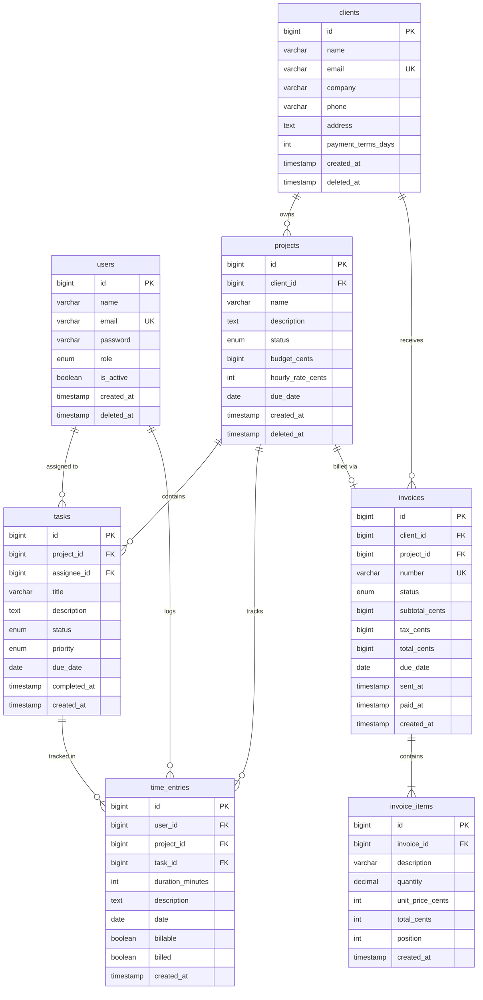

# Database Schema Documentation

Complete database schema for the Agency Platform.

---

## Overview

- **Database Engine:** MySQL 8.0
- **Character Set:** utf8mb4
- **Collation:** utf8mb4_unicode_ci
- **Naming Convention:** snake_case for tables and columns

---

## Entity Relationship Diagram



---

## Core Tables

### users

User accounts for all platform users.

| Column | Type | Nullable | Default | Description |
|--------|------|----------|---------|-------------|
| id | bigint unsigned | NO | auto | Primary key |
| name | varchar(255) | NO | | Full name |
| email | varchar(255) | NO | | Email (unique) |
| email_verified_at | timestamp | YES | NULL | Email verification |
| password | varchar(255) | NO | | Hashed password |
| role | enum | NO | 'staff' | admin, manager, staff |
| is_active | boolean | NO | true | Account status |
| timezone | varchar(50) | YES | 'UTC' | User timezone |
| avatar_path | varchar(255) | YES | NULL | Profile image path |
| remember_token | varchar(100) | YES | NULL | Session token |
| created_at | timestamp | YES | NULL | Creation time |
| updated_at | timestamp | YES | NULL | Last update |
| deleted_at | timestamp | YES | NULL | Soft delete |

**Indexes:**
- PRIMARY (id)
- UNIQUE (email)
- INDEX (role)
- INDEX (is_active)

---

### clients

Client organizations/contacts.

| Column | Type | Nullable | Default | Description |
|--------|------|----------|---------|-------------|
| id | bigint unsigned | NO | auto | Primary key |
| name | varchar(255) | NO | | Contact name |
| email | varchar(255) | NO | | Primary email |
| company | varchar(255) | YES | NULL | Company name |
| phone | varchar(50) | YES | NULL | Phone number |
| address | text | YES | NULL | Full address |
| tax_id | varchar(50) | YES | NULL | Tax ID/VAT |
| payment_terms_days | int | NO | 30 | Default payment terms |
| notes | text | YES | NULL | Internal notes |
| created_at | timestamp | YES | NULL | Creation time |
| updated_at | timestamp | YES | NULL | Last update |
| deleted_at | timestamp | YES | NULL | Soft delete |

**Indexes:**
- PRIMARY (id)
- UNIQUE (email)
- INDEX (company)

---

### projects

Client projects and engagements.

| Column | Type | Nullable | Default | Description |
|--------|------|----------|---------|-------------|
| id | bigint unsigned | NO | auto | Primary key |
| client_id | bigint unsigned | NO | | FK to clients |
| name | varchar(255) | NO | | Project name |
| description | text | YES | NULL | Project description |
| status | enum | NO | 'draft' | draft, active, on_hold, completed, archived |
| budget_cents | bigint | YES | NULL | Budget in cents |
| hourly_rate_cents | int | YES | NULL | Default hourly rate |
| due_date | date | YES | NULL | Target completion |
| started_at | timestamp | YES | NULL | Actual start |
| completed_at | timestamp | YES | NULL | Completion time |
| created_at | timestamp | YES | NULL | Creation time |
| updated_at | timestamp | YES | NULL | Last update |
| deleted_at | timestamp | YES | NULL | Soft delete |

**Indexes:**
- PRIMARY (id)
- FOREIGN KEY (client_id) REFERENCES clients(id)
- INDEX (status)
- INDEX (due_date)

---

### tasks

Project tasks and work items.

| Column | Type | Nullable | Default | Description |
|--------|------|----------|---------|-------------|
| id | bigint unsigned | NO | auto | Primary key |
| project_id | bigint unsigned | NO | | FK to projects |
| assignee_id | bigint unsigned | YES | NULL | FK to users |
| title | varchar(255) | NO | | Task title |
| description | text | YES | NULL | Task details |
| status | enum | NO | 'pending' | pending, in_progress, completed |
| priority | enum | NO | 'medium' | low, medium, high, urgent |
| estimated_hours | decimal(8,2) | YES | NULL | Hour estimate |
| due_date | date | YES | NULL | Due date |
| completed_at | timestamp | YES | NULL | Completion time |
| position | int | NO | 0 | Sort order |
| created_at | timestamp | YES | NULL | Creation time |
| updated_at | timestamp | YES | NULL | Last update |
| deleted_at | timestamp | YES | NULL | Soft delete |

**Indexes:**
- PRIMARY (id)
- FOREIGN KEY (project_id) REFERENCES projects(id) ON DELETE CASCADE
- FOREIGN KEY (assignee_id) REFERENCES users(id) ON DELETE SET NULL
- INDEX (status)
- INDEX (assignee_id, status)
- INDEX (project_id, position)

---

### time_entries

Time tracking records.

| Column | Type | Nullable | Default | Description |
|--------|------|----------|---------|-------------|
| id | bigint unsigned | NO | auto | Primary key |
| user_id | bigint unsigned | NO | | FK to users |
| project_id | bigint unsigned | NO | | FK to projects |
| task_id | bigint unsigned | YES | NULL | FK to tasks |
| description | text | YES | NULL | Work description |
| duration_minutes | int | NO | | Duration in minutes |
| date | date | NO | | Work date |
| billable | boolean | NO | true | Is billable |
| billed | boolean | NO | false | Has been billed |
| invoice_id | bigint unsigned | YES | NULL | FK to invoices |
| started_at | timestamp | YES | NULL | Timer start |
| stopped_at | timestamp | YES | NULL | Timer stop |
| created_at | timestamp | YES | NULL | Creation time |
| updated_at | timestamp | YES | NULL | Last update |

**Indexes:**
- PRIMARY (id)
- FOREIGN KEY (user_id) REFERENCES users(id)
- FOREIGN KEY (project_id) REFERENCES projects(id) ON DELETE CASCADE
- FOREIGN KEY (task_id) REFERENCES tasks(id) ON DELETE SET NULL
- FOREIGN KEY (invoice_id) REFERENCES invoices(id) ON DELETE SET NULL
- INDEX (user_id, date)
- INDEX (project_id, billable, billed)
- INDEX (date)

---

### invoices

Client invoices.

| Column | Type | Nullable | Default | Description |
|--------|------|----------|---------|-------------|
| id | bigint unsigned | NO | auto | Primary key |
| client_id | bigint unsigned | NO | | FK to clients |
| project_id | bigint unsigned | YES | NULL | FK to projects |
| number | varchar(50) | NO | | Invoice number (unique) |
| status | enum | NO | 'draft' | draft, sent, paid, overdue, cancelled |
| subtotal_cents | bigint | NO | 0 | Subtotal in cents |
| tax_rate | decimal(5,2) | NO | 0 | Tax percentage |
| tax_cents | bigint | NO | 0 | Tax in cents |
| total_cents | bigint | NO | 0 | Total in cents |
| currency | char(3) | NO | 'USD' | ISO currency code |
| due_date | date | YES | NULL | Payment due date |
| notes | text | YES | NULL | Invoice notes |
| payment_instructions | text | YES | NULL | How to pay |
| sent_at | timestamp | YES | NULL | When sent |
| paid_at | timestamp | YES | NULL | When paid |
| stripe_payment_intent_id | varchar(255) | YES | NULL | Stripe reference |
| created_at | timestamp | YES | NULL | Creation time |
| updated_at | timestamp | YES | NULL | Last update |
| deleted_at | timestamp | YES | NULL | Soft delete |

**Indexes:**
- PRIMARY (id)
- UNIQUE (number)
- FOREIGN KEY (client_id) REFERENCES clients(id)
- FOREIGN KEY (project_id) REFERENCES projects(id) ON DELETE SET NULL
- INDEX (status)
- INDEX (due_date, status)
- INDEX (client_id, status)

---

### invoice_items

Invoice line items.

| Column | Type | Nullable | Default | Description |
|--------|------|----------|---------|-------------|
| id | bigint unsigned | NO | auto | Primary key |
| invoice_id | bigint unsigned | NO | | FK to invoices |
| description | varchar(500) | NO | | Item description |
| quantity | decimal(10,2) | NO | 1 | Quantity |
| unit_price_cents | int | NO | | Price per unit |
| total_cents | int | NO | | Line total |
| position | int | NO | 0 | Sort order |
| created_at | timestamp | YES | NULL | Creation time |
| updated_at | timestamp | YES | NULL | Last update |

**Indexes:**
- PRIMARY (id)
- FOREIGN KEY (invoice_id) REFERENCES invoices(id) ON DELETE CASCADE
- INDEX (invoice_id, position)

---

## Supporting Tables

### activity_log

Audit trail using Spatie Activity Log.

| Column | Type | Nullable | Default | Description |
|--------|------|----------|---------|-------------|
| id | bigint unsigned | NO | auto | Primary key |
| log_name | varchar(255) | YES | NULL | Log category |
| description | text | NO | | Activity description |
| subject_type | varchar(255) | YES | NULL | Subject model |
| subject_id | bigint unsigned | YES | NULL | Subject ID |
| causer_type | varchar(255) | YES | NULL | Actor model |
| causer_id | bigint unsigned | YES | NULL | Actor ID |
| properties | json | YES | NULL | Additional data |
| batch_uuid | uuid | YES | NULL | Batch grouping |
| created_at | timestamp | YES | NULL | Creation time |
| updated_at | timestamp | YES | NULL | Last update |

---

### notifications

Laravel notification storage.

| Column | Type | Nullable | Default | Description |
|--------|------|----------|---------|-------------|
| id | uuid | NO | | Primary key |
| type | varchar(255) | NO | | Notification class |
| notifiable_type | varchar(255) | NO | | Recipient model |
| notifiable_id | bigint unsigned | NO | | Recipient ID |
| data | text | NO | | JSON payload |
| read_at | timestamp | YES | NULL | When read |
| created_at | timestamp | YES | NULL | Creation time |
| updated_at | timestamp | YES | NULL | Last update |

---

### personal_access_tokens

Laravel Sanctum API tokens.

| Column | Type | Nullable | Default | Description |
|--------|------|----------|---------|-------------|
| id | bigint unsigned | NO | auto | Primary key |
| tokenable_type | varchar(255) | NO | | Token owner model |
| tokenable_id | bigint unsigned | NO | | Token owner ID |
| name | varchar(255) | NO | | Token name |
| token | varchar(64) | NO | | Hashed token |
| abilities | text | YES | NULL | Token scopes |
| last_used_at | timestamp | YES | NULL | Last use |
| expires_at | timestamp | YES | NULL | Expiration |
| created_at | timestamp | YES | NULL | Creation time |
| updated_at | timestamp | YES | NULL | Last update |

---

## Indexes Strategy

### Query Optimization

Primary query patterns and their indexes:

| Query Pattern | Index |
|--------------|-------|
| User login | users(email) |
| User's projects | projects(client_id) via user→client |
| Project tasks | tasks(project_id, status) |
| User timesheet | time_entries(user_id, date) |
| Billable time | time_entries(project_id, billable, billed) |
| Outstanding invoices | invoices(status, due_date) |
| Client invoices | invoices(client_id, status) |

### Composite Indexes

```sql
-- User's active assigned tasks
CREATE INDEX idx_tasks_assignee_status
ON tasks(assignee_id, status)
WHERE deleted_at IS NULL;

-- Unbilled time entries by project
CREATE INDEX idx_time_entries_unbilled
ON time_entries(project_id, billable, billed)
WHERE billable = 1 AND billed = 0;

-- Overdue invoices
CREATE INDEX idx_invoices_overdue
ON invoices(due_date, status)
WHERE status = 'sent';
```

---

## Data Types

### Money

All monetary values stored as integers in cents:
- `budget_cents` - Project budget
- `hourly_rate_cents` - Billing rate
- `unit_price_cents` - Invoice item price
- `total_cents` - Calculated totals

Convert for display: `$amount = $cents / 100`

### Enums

```sql
-- Project status
ENUM('draft', 'active', 'on_hold', 'completed', 'archived')

-- Task status
ENUM('pending', 'in_progress', 'completed')

-- Task priority
ENUM('low', 'medium', 'high', 'urgent')

-- Invoice status
ENUM('draft', 'sent', 'paid', 'overdue', 'cancelled')

-- User role
ENUM('admin', 'manager', 'staff')
```

### Timestamps

All tables use:
- `created_at` - Record creation
- `updated_at` - Last modification
- `deleted_at` - Soft delete (where applicable)

Stored in UTC, converted to user timezone for display.

---

## Migration Strategy

### Creating Migrations

```bash
# Generate migration
php artisan make:migration add_field_to_projects_table

# Naming conventions
# create_[table]_table - New table
# add_[column]_to_[table]_table - Add column
# drop_[column]_from_[table]_table - Remove column
# modify_[column]_in_[table]_table - Change column
```

### Safe Migrations

For zero-downtime deployments:

1. **Add columns as nullable** first
2. **Deploy code** that handles null
3. **Backfill data** via queue job
4. **Add constraints** after data populated

### Rollback Procedures

```bash
# Rollback last batch
php artisan migrate:rollback

# Rollback specific steps
php artisan migrate:rollback --step=3

# Check migration status
php artisan migrate:status
```

---

## Related Documents

- [Architecture Specification](./arch-agency-platform.md)
- [ADR-0001: Tech Stack](../03-decisions/adr-0001-tech-stack.md)
- [Data Management](../07-operations/data-management.md)

---

## Change Log

| Date | Version | Author | Change Description |
|------|---------|--------|-------------------|
| 2025-11-29 | 1.0.0 | Claude | Initial database schema documentation |
