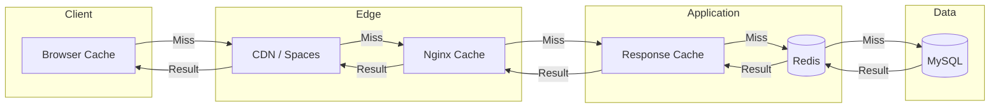

# ADR-0020: Performance Optimization Strategy

## Context and Problem Statement

The platform must meet specific performance targets:
- [REQ-PERF-001](../01-requirements/req-perf-001.md): Page Load Under 3 Seconds
- [REQ-PERF-002](../01-requirements/req-perf-002.md): API Response Under 500ms
- [REQ-PERF-005](../01-requirements/req-perf-005.md): Database Query Optimization
- [REQ-PERF-006](../01-requirements/req-perf-006.md): Caching Strategy

Performance impacts user experience, SEO rankings, and overall platform reliability.

## Decision Drivers

- **User Experience:** Fast pages increase engagement and satisfaction
- **SEO:** Core Web Vitals affect search rankings
- **Scalability:** Efficient code handles more users per server
- **Cost:** Better performance = fewer servers needed
- **Measurability:** Clear metrics to track and improve

## Considered Options

The performance strategy involves decisions across multiple layers:

### Caching Strategy Options
1. **Option A:** Redis caching (application + session + queue)
2. **Option B:** File-based caching
3. **Option C:** Memcached
4. **Option D:** Multi-layer (Redis + HTTP caching)

### Frontend Optimization Options
1. **Option A:** Vite bundling + lazy loading
2. **Option B:** Traditional webpack
3. **Option C:** No bundling (HTTP/2 modules)

### Database Optimization Options
1. **Option A:** Query optimization + indexing + read replica
2. **Option B:** Query caching only
3. **Option C:** Database sharding

## Decision Outcome

### Caching Strategy

**Chosen Option:** Option D - Multi-layer caching (Redis + HTTP caching)



### Frontend Optimization

**Chosen Option:** Option A - Vite bundling + lazy loading + asset optimization

### Database Optimization

**Chosen Option:** Option A - Query optimization + indexing + read replica (when scaling)

### Consequences

#### Positive

- Sub-second responses for cached content
- Reduced database load via query caching
- Optimized frontend bundles reduce initial load
- Clear caching hierarchy for debugging
- Cost-effective (Redis is already provisioned)

#### Negative

- Cache invalidation complexity
- Multiple cache layers to manage
- Must be careful with stale data
- Read replica adds complexity when needed

#### Risks

- **Risk:** Cache stampede on invalidation
  - **Mitigation:** Use cache locks; staggered expiration
- **Risk:** Stale data shown to users
  - **Mitigation:** Event-driven cache invalidation; short TTLs for volatile data
- **Risk:** Over-caching causes bugs
  - **Mitigation:** Clear cache strategy per data type; comprehensive testing

## Validation

- **Metric 1:** 95th percentile page load under 3 seconds
- **Metric 2:** 95th percentile API response under 500ms
- **Metric 3:** Database query count per page under 20
- **Metric 4:** Cache hit rate above 80%
- **Metric 5:** Lighthouse Performance score above 90

## Implementation Notes

### Caching Architecture

```
┌─────────────────────────────────────────────────────────────────┐
│                      CACHING LAYERS                              │
├─────────────────────────────────────────────────────────────────┤
│                                                                  │
│  Layer 1: Browser Cache                                         │
│  ├── Static assets: 1 year (versioned filenames)                │
│  ├── Images: 1 year (versioned)                                 │
│  └── API responses: varies (Cache-Control headers)              │
│                                                                  │
│  Layer 2: CDN (DigitalOcean Spaces CDN)                         │
│  ├── Static assets from /build/*                                │
│  ├── Media library images                                       │
│  └── Invoice PDFs (signed URLs)                                 │
│                                                                  │
│  Layer 3: HTTP Response Cache                                   │
│  ├── Full page cache for marketing (spatie/laravel-responsecache)│
│  ├── Statamic static cache for CMS pages                        │
│  └── TTL: 1 hour for marketing, 10 min for portal               │
│                                                                  │
│  Layer 4: Application Cache (Redis)                             │
│  ├── Config cache (artisan config:cache)                        │
│  ├── Route cache (artisan route:cache)                          │
│  ├── View cache (artisan view:cache)                            │
│  ├── Query results (remember())                                 │
│  └── Computed values (dashboard stats)                          │
│                                                                  │
│  Layer 5: Database                                               │
│  ├── Optimized indexes                                          │
│  ├── Query builder optimization                                 │
│  └── Eager loading relationships                                │
│                                                                  │
└─────────────────────────────────────────────────────────────────┘
```

### Redis Configuration

```php
// config/cache.php
'default' => 'redis',

'stores' => [
    'redis' => [
        'driver' => 'redis',
        'connection' => 'cache',
        'lock_connection' => 'default',
    ],
],

// config/database.php
'redis' => [
    'client' => 'phpredis',
    'default' => [
        'host' => env('REDIS_HOST'),
        'password' => env('REDIS_PASSWORD'),
        'port' => env('REDIS_PORT'),
        'database' => 0,
    ],
    'cache' => [
        'host' => env('REDIS_HOST'),
        'password' => env('REDIS_PASSWORD'),
        'port' => env('REDIS_PORT'),
        'database' => 1,
    ],
    'sessions' => [
        'host' => env('REDIS_HOST'),
        'password' => env('REDIS_PASSWORD'),
        'port' => env('REDIS_PORT'),
        'database' => 2,
    ],
],
```

### Response Caching

```php
// composer require spatie/laravel-responsecache

// config/responsecache.php
return [
    'enabled' => env('RESPONSE_CACHE_ENABLED', true),
    'cache_lifetime_in_seconds' => 3600, // 1 hour
    'cache_store' => 'redis',
    'cache_tag' => 'responsecache',
];

// Middleware for cacheable routes
Route::middleware('cacheResponse:3600')->group(function () {
    Route::get('/', HomeController::class);
    Route::get('/services', ServicesController::class);
    Route::get('/portfolio', PortfolioController::class);
});

// Cache invalidation on content change
class ClearResponseCache
{
    public function handle(EntryUpdated $event)
    {
        ResponseCache::forget($event->entry->url());
    }
}
```

### Query Caching

```php
// Cache expensive queries
public function getDashboardStats(): array
{
    return Cache::remember('dashboard.stats.' . auth()->id(), 300, function () {
        return [
            'active_projects' => Project::active()->count(),
            'pending_invoices' => Invoice::pending()->sum('amount'),
            'hours_this_month' => TimeEntry::thisMonth()->sum('duration'),
            'revenue_mtd' => Invoice::paid()->thisMonth()->sum('amount'),
        ];
    });
}

// Cache with tags for easy invalidation
public function getProjectStats(Project $project): array
{
    return Cache::tags(['project', "project.{$project->id}"])
        ->remember("project.{$project->id}.stats", 600, function () use ($project) {
            return [
                'tasks_complete' => $project->tasks()->completed()->count(),
                'tasks_total' => $project->tasks()->count(),
                'hours_logged' => $project->timeEntries()->sum('duration'),
                'budget_used' => $project->calculateBudgetUsed(),
            ];
        });
}

// Invalidate on update
protected static function booted()
{
    static::updated(function (Project $project) {
        Cache::tags(["project.{$project->id}"])->flush();
    });
}
```

### Database Optimization

```php
// Add indexes for common queries
// database/migrations/add_performance_indexes.php
Schema::table('projects', function (Blueprint $table) {
    $table->index(['client_id', 'status']);
    $table->index(['created_at']);
    $table->index(['status', 'due_date']);
});

Schema::table('tasks', function (Blueprint $table) {
    $table->index(['project_id', 'status']);
    $table->index(['assignee_id', 'status']);
    $table->index(['due_date']);
});

Schema::table('invoices', function (Blueprint $table) {
    $table->index(['client_id', 'status']);
    $table->index(['due_date', 'status']);
});

// Eager loading to prevent N+1
public function index()
{
    $projects = Project::query()
        ->with([
            'client:id,name',
            'tasks:id,project_id,status',
            'tasks.assignee:id,name',
        ])
        ->withCount(['tasks', 'tasks as completed_tasks_count' => fn($q) => $q->completed()])
        ->latest()
        ->paginate(20);
}

// Use select to limit columns
$clients = Client::select(['id', 'name', 'email', 'company'])
    ->withCount('projects')
    ->get();
```

### Frontend Optimization

```js
// vite.config.js
import { defineConfig } from 'vite';
import laravel from 'laravel-vite-plugin';

export default defineConfig({
    plugins: [
        laravel({
            input: ['resources/css/app.css', 'resources/js/app.js'],
            refresh: true,
        }),
    ],
    build: {
        // Code splitting
        rollupOptions: {
            output: {
                manualChunks: {
                    vendor: ['alpinejs', 'axios'],
                    charts: ['chart.js'],
                },
            },
        },
        // Minification
        minify: 'terser',
        terserOptions: {
            compress: {
                drop_console: true,
            },
        },
    },
});
```

```blade
{{-- Lazy load images --}}
url }}?w=400" alt="{{ $image->alt }}" loading="lazy">

{{-- Preload critical assets --}}
@push('head')
    <link rel="preload" href="{{ Vite::asset('resources/css/app.css') }}" as="style">
    <link rel="preload" href="{{ Vite::asset('resources/js/app.js') }}" as="script">
    <link rel="preconnect" href="https://fonts.googleapis.com">
@endpush

{{-- Defer non-critical JS --}}
<script src="{{ Vite::asset('resources/js/charts.js') }}" defer></script>
```

### Monitoring Performance

```php
// Log slow queries in development
// app/Providers/AppServiceProvider.php
if (app()->environment('local')) {
    DB::listen(function ($query) {
        if ($query->time > 100) {
            Log::warning('Slow query detected', [
                'sql' => $query->sql,
                'bindings' => $query->bindings,
                'time' => $query->time,
            ]);
        }
    });
}

// Track query count per request
// app/Http/Middleware/QueryCountMiddleware.php
class QueryCountMiddleware
{
    public function handle($request, Closure $next)
    {
        $queryCount = 0;
        DB::listen(function () use (&$queryCount) {
            $queryCount++;
        });

        $response = $next($request);

        if ($queryCount > 20) {
            Log::warning('High query count', [
                'url' => $request->url(),
                'count' => $queryCount,
            ]);
        }

        return $response;
    }
}
```

### Performance Testing

```php
// tests/Feature/PerformanceTest.php
class PerformanceTest extends TestCase
{
    public function test_homepage_loads_under_3_seconds()
    {
        $start = microtime(true);
        $response = $this->get('/');
        $duration = microtime(true) - $start;

        $response->assertOk();
        $this->assertLessThan(3, $duration);
    }

    public function test_api_responds_under_500ms()
    {
        $user = User::factory()->create();

        $start = microtime(true);
        $response = $this->actingAs($user)->getJson('/api/projects');
        $duration = microtime(true) - $start;

        $response->assertOk();
        $this->assertLessThan(0.5, $duration);
    }

    public function test_dashboard_query_count()
    {
        $user = User::factory()->create();
        Project::factory(10)->create(['user_id' => $user->id]);

        DB::enableQueryLog();
        $this->actingAs($user)->get('/dashboard');
        $queryCount = count(DB::getQueryLog());

        $this->assertLessThan(20, $queryCount);
    }
}
```

### Nginx Caching

```nginx
# /etc/nginx/sites-available/app.conf
# Micro-caching for API responses
location /api/ {
    # Cache successful responses for 1 second (micro-cache)
    proxy_cache_valid 200 1s;
    proxy_cache_use_stale error timeout updating;
    proxy_cache_lock on;

    try_files $uri $uri/ /index.php?$query_string;
}

# Static asset caching
location ~* \.(js|css|png|jpg|jpeg|gif|ico|svg|woff|woff2)$ {
    expires 1y;
    add_header Cache-Control "public, immutable";
    access_log off;
}
```

## Links

- [REQ-PERF-001](../01-requirements/req-perf-001.md) - Page Load Under 3 Seconds
- [REQ-PERF-002](../01-requirements/req-perf-002.md) - API Response Under 500ms
- [REQ-PERF-005](../01-requirements/req-perf-005.md) - Database Query Optimization
- [REQ-PERF-006](../01-requirements/req-perf-006.md) - Caching Strategy
- [ADR-0011](./adr-0011-infrastructure-hosting.md) - Infrastructure (Redis provisioning)
- [ADR-0015](./adr-0015-file-storage-cdn.md) - CDN for static assets
- [Laravel Cache Documentation](https://laravel.com/docs/cache)
- [Spatie Response Cache](https://github.com/spatie/laravel-responsecache)
- [SOP-000: Golden Thread](../00-governance/sop-000-master.md)

## Change Log

| Date       | Author       | Change Description                     |
|------------|--------------|----------------------------------------|
| 2025-11-29 | Claude       | Initial draft                          |
