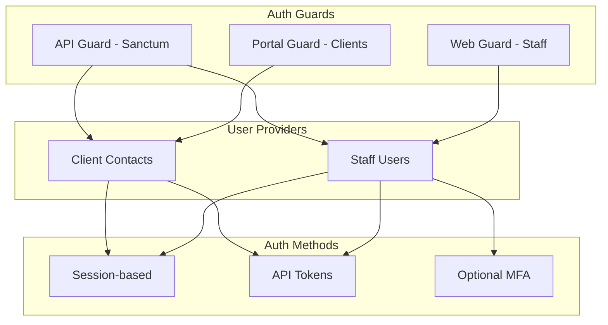

# Authentication & Authorization Guide

Complete authentication and authorization implementation for the Agency Platform.

---

## Authentication Architecture



---

## Guard Configuration

```php
// config/auth.php
return [
    'defaults' => [
        'guard' => 'web',
        'passwords' => 'users',
    ],

    'guards' => [
        'web' => [
            'driver' => 'session',
            'provider' => 'users',
        ],
        'portal' => [
            'driver' => 'session',
            'provider' => 'contacts',
        ],
        'sanctum' => [
            'driver' => 'sanctum',
            'provider' => null,  // Can auth any provider
        ],
    ],

    'providers' => [
        'users' => [
            'driver' => 'eloquent',
            'model' => App\Models\User::class,
        ],
        'contacts' => [
            'driver' => 'eloquent',
            'model' => App\Models\ClientContact::class,
        ],
    ],

    'passwords' => [
        'users' => [
            'provider' => 'users',
            'table' => 'password_reset_tokens',
            'expire' => 60,
            'throttle' => 60,
        ],
        'contacts' => [
            'provider' => 'contacts',
            'table' => 'password_reset_tokens',
            'expire' => 60,
            'throttle' => 60,
        ],
    ],

    'password_timeout' => 10800,
];
```

---

## Multi-Guard Usage

### In Controllers

```php
// Staff authentication (default)
public function staffDashboard()
{
    $user = auth()->user();  // Staff user
    // or
    $user = auth('web')->user();
}

// Client portal authentication
public function portalDashboard()
{
    $contact = auth('portal')->user();  // Client contact
}

// API authentication (either user type)
public function apiEndpoint(Request $request)
{
    $user = $request->user();  // Could be User or ClientContact
}
```

### Middleware Configuration

```php
// routes/web.php - Staff routes
Route::middleware(['auth:web', 'verified'])->group(function () {
    Route::get('/dashboard', DashboardController::class);
    Route::resource('/projects', ProjectController::class);
});

// routes/portal.php - Client portal routes
Route::prefix('portal')
    ->middleware(['auth:portal'])
    ->group(function () {
        Route::get('/dashboard', [PortalController::class, 'dashboard']);
        Route::get('/invoices', [PortalController::class, 'invoices']);
    });

// routes/api.php - API routes
Route::middleware(['auth:sanctum'])->group(function () {
    Route::apiResource('/projects', Api\ProjectController::class);
    Route::apiResource('/invoices', Api\InvoiceController::class);
});
```

---

## Sanctum API Authentication

### Token Generation

```php
// Generate API token for staff
public function createToken(Request $request): JsonResponse
{
    $request->validate([
        'email' => 'required|email',
        'password' => 'required',
        'device_name' => 'required|string|max:255',
    ]);

    $user = User::where('email', $request->email)->first();

    if (! $user || ! Hash::check($request->password, $user->password)) {
        throw ValidationException::withMessages([
            'email' => ['The provided credentials are incorrect.'],
        ]);
    }

    $token = $user->createToken(
        $request->device_name,
        ['read', 'write']  // Abilities/scopes
    );

    return response()->json([
        'token' => $token->plainTextToken,
        'expires_at' => now()->addDays(30)->toIso8601String(),
    ]);
}

// Revoke token
public function revokeToken(Request $request): JsonResponse
{
    $request->user()->currentAccessToken()->delete();

    return response()->json(['message' => 'Token revoked']);
}

// Revoke all tokens
public function revokeAllTokens(Request $request): JsonResponse
{
    $request->user()->tokens()->delete();

    return response()->json(['message' => 'All tokens revoked']);
}
```

### Token Abilities (Scopes)

```php
// Create token with specific abilities
$token = $user->createToken('api-client', ['projects:read', 'invoices:read']);

// Check abilities in middleware
Route::get('/projects', function () {
    // ...
})->middleware(['auth:sanctum', 'abilities:projects:read']);

// Check in controller
public function store(Request $request)
{
    if (! $request->user()->tokenCan('projects:write')) {
        abort(403);
    }
}
```

---

## Role-Based Access Control (RBAC)

### Using Spatie Permission

```php
// Define roles (in seeder)
$admin = Role::create(['name' => 'admin']);
$manager = Role::create(['name' => 'manager']);
$staff = Role::create(['name' => 'staff']);

// Define permissions
$permissions = [
    'view projects', 'create projects', 'edit projects', 'delete projects',
    'view invoices', 'create invoices', 'send invoices', 'void invoices',
    'view users', 'create users', 'edit users', 'delete users',
    'impersonate users',
    'access admin',
    'view reports',
];

foreach ($permissions as $permission) {
    Permission::create(['name' => $permission]);
}

// Assign permissions to roles
$admin->givePermissionTo(Permission::all());

$manager->givePermissionTo([
    'view projects', 'create projects', 'edit projects',
    'view invoices', 'create invoices', 'send invoices',
    'view users',
    'view reports',
]);

$staff->givePermissionTo([
    'view projects',
    'view invoices',
]);
```

### Usage in Code

```php
// Assign role to user
$user->assignRole('admin');
$user->assignRole(['manager', 'editor']);

// Check role
if ($user->hasRole('admin')) {
    // ...
}

if ($user->hasAnyRole(['admin', 'manager'])) {
    // ...
}

// Check permission
if ($user->can('create projects')) {
    // ...
}

// In Blade
@role('admin')
    <a href="/admin">Admin Panel</a>
@endrole

@can('create projects')
    <button>New Project</button>
@endcan
```

### Middleware

```php
// Role middleware
Route::group(['middleware' => ['role:admin']], function () {
    Route::get('/admin/users', [UserController::class, 'index']);
});

// Permission middleware
Route::group(['middleware' => ['permission:edit projects']], function () {
    Route::put('/projects/{project}', [ProjectController::class, 'update']);
});

// Role OR permission
Route::group(['middleware' => ['role_or_permission:admin|edit projects']], function () {
    // ...
});
```

---

## Policy-Based Authorization

### Creating Policies

```php
// app/Policies/ProjectPolicy.php
<?php

declare(strict_types=1);

namespace App\Policies;

use App\Models\Project;
use App\Models\User;

final class ProjectPolicy
{
    /**
     * Determine if user can view any projects.
     */
    public function viewAny(User $user): bool
    {
        return $user->can('view projects');
    }

    /**
     * Determine if user can view the project.
     */
    public function view(User $user, Project $project): bool
    {
        // Admin can view all
        if ($user->hasRole('admin')) {
            return true;
        }

        // Check if user is assigned to project
        return $project->team->contains($user);
    }

    /**
     * Determine if user can create projects.
     */
    public function create(User $user): bool
    {
        return $user->can('create projects');
    }

    /**
     * Determine if user can update the project.
     */
    public function update(User $user, Project $project): bool
    {
        if ($user->can('edit projects')) {
            return true;
        }

        return $project->owner_id === $user->id;
    }

    /**
     * Determine if user can delete the project.
     */
    public function delete(User $user, Project $project): bool
    {
        // Only admin or owner can delete
        return $user->hasRole('admin') || $project->owner_id === $user->id;
    }

    /**
     * Determine if user can restore the project.
     */
    public function restore(User $user, Project $project): bool
    {
        return $user->hasRole('admin');
    }

    /**
     * Determine if user can permanently delete.
     */
    public function forceDelete(User $user, Project $project): bool
    {
        return $user->hasRole('admin');
    }

    /**
     * Determine if user can complete the project.
     */
    public function complete(User $user, Project $project): bool
    {
        return $user->can('edit projects') && $project->canBeCompleted();
    }
}
```

### Using Policies

```php
// In controllers
public function update(UpdateProjectRequest $request, Project $project)
{
    $this->authorize('update', $project);

    // Update logic
}

public function store(StoreProjectRequest $request)
{
    $this->authorize('create', Project::class);

    // Create logic
}

// Inline checks
if ($user->can('update', $project)) {
    // ...
}

if ($user->cannot('delete', $project)) {
    abort(403);
}

// In Blade
@can('update', $project)
    <a href="{{ route('projects.edit', $project) }}">Edit</a>
@endcan
```

---

## Gates

```php
// app/Providers/AuthServiceProvider.php
public function boot(): void
{
    // Super admin bypass
    Gate::before(function (User $user, string $ability) {
        if ($user->isSuperAdmin()) {
            return true;
        }
    });

    // Custom gates
    Gate::define('access-admin', function (User $user) {
        return $user->hasAnyRole(['admin', 'manager']);
    });

    Gate::define('impersonate', function (User $user, User $target) {
        return $user->can('impersonate users')
            && ! $target->hasRole('admin')
            && $user->id !== $target->id;
    });

    Gate::define('view-sensitive-data', function (User $user) {
        return $user->hasRole('admin') || $user->hasPermissionTo('view sensitive data');
    });

    Gate::define('export-data', function (User $user) {
        // Rate limit exports
        $todayExports = $user->exports()->whereDate('created_at', today())->count();
        return $todayExports < 10;
    });
}

// Usage
if (Gate::allows('access-admin')) {
    // ...
}

Gate::authorize('impersonate', $targetUser);

@can('view-sensitive-data')
    <div>Sensitive content</div>
@endcan
```

---

## MFA Implementation

### Setup with Google2FA

```php
// Install: composer require pragmarx/google2fa-laravel

// app/Http/Controllers/Auth/TwoFactorController.php
public function enable(Request $request): JsonResponse
{
    $user = $request->user();
    $google2fa = app('pragmarx.google2fa');

    $secret = $google2fa->generateSecretKey();

    $user->update(['two_factor_secret' => encrypt($secret)]);

    $qrCodeUrl = $google2fa->getQRCodeUrl(
        config('app.name'),
        $user->email,
        $secret
    );

    return response()->json([
        'secret' => $secret,
        'qr_code' => $qrCodeUrl,
    ]);
}

public function confirm(Request $request): JsonResponse
{
    $request->validate(['code' => 'required|string|size:6']);

    $user = $request->user();
    $google2fa = app('pragmarx.google2fa');

    $valid = $google2fa->verifyKey(
        decrypt($user->two_factor_secret),
        $request->code
    );

    if (! $valid) {
        throw ValidationException::withMessages([
            'code' => ['Invalid verification code.'],
        ]);
    }

    $user->update([
        'two_factor_confirmed_at' => now(),
        'two_factor_recovery_codes' => encrypt(json_encode(
            Collection::times(8, fn () => Str::random(10) . '-' . Str::random(10))
        )),
    ]);

    return response()->json(['message' => '2FA enabled']);
}
```

### MFA Middleware

```php
// app/Http/Middleware/EnsureTwoFactorAuthenticated.php
public function handle(Request $request, Closure $next): Response
{
    $user = $request->user();

    if ($user?->hasTwoFactorEnabled() && ! $request->session()->get('2fa_verified')) {
        return redirect()->route('two-factor.challenge');
    }

    return $next($request);
}
```

---

## Session Security

```php
// config/session.php
return [
    'driver' => env('SESSION_DRIVER', 'redis'),
    'lifetime' => 120,
    'expire_on_close' => false,
    'encrypt' => true,
    'cookie' => 'agency_session',
    'path' => '/',
    'domain' => env('SESSION_DOMAIN'),
    'secure' => env('SESSION_SECURE_COOKIE', true),
    'http_only' => true,
    'same_site' => 'lax',
];

// Force HTTPS and secure cookies
// app/Providers/AppServiceProvider.php
public function boot(): void
{
    if (app()->environment('production')) {
        URL::forceScheme('https');
    }
}
```

---

## Testing Authentication

```php
// tests/Feature/AuthenticationTest.php

test('users can login with correct credentials', function () {
    $user = User::factory()->create();

    $response = $this->post('/login', [
        'email' => $user->email,
        'password' => 'password',
    ]);

    $this->assertAuthenticated();
    $response->assertRedirect('/dashboard');
});

test('users cannot login with incorrect password', function () {
    $user = User::factory()->create();

    $this->post('/login', [
        'email' => $user->email,
        'password' => 'wrong-password',
    ]);

    $this->assertGuest();
});

// Testing authorization
test('unauthorized users cannot access admin', function () {
    $user = User::factory()->create();
    $user->assignRole('staff');

    $this->actingAs($user)
        ->get('/admin')
        ->assertForbidden();
});

test('admin can access admin panel', function () {
    $admin = User::factory()->create();
    $admin->assignRole('admin');

    $this->actingAs($admin)
        ->get('/admin')
        ->assertOk();
});

// Testing policies
test('project owner can update project', function () {
    $user = User::factory()->create();
    $project = Project::factory()->create(['owner_id' => $user->id]);

    $this->actingAs($user)
        ->put("/projects/{$project->id}", ['name' => 'Updated'])
        ->assertOk();
});

test('non-owner cannot delete project', function () {
    $user = User::factory()->create();
    $project = Project::factory()->create();  // Different owner

    $this->actingAs($user)
        ->delete("/projects/{$project->id}")
        ->assertForbidden();
});
```

---

## Related Documentation

- [Security Policies](../08-security/security-policies.md) - Security overview
- [ADR-0012: Security](../03-decisions/adr-0012-security-data-protection.md) - Auth decisions
- [API Specification](../05-api/api-specification.md) - API authentication
- [Development Standards](./dev-standards.md) - Code standards

---

## Change Log

| Date | Version | Author | Change Description |
|------|---------|--------|-------------------|
| 2025-11-30 | 1.0.0 | Claude | Initial auth guide |
