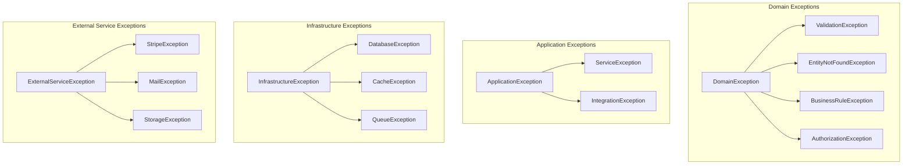

# Exception Hierarchy & Error Handling

Comprehensive error handling strategy for the Agency Platform.

---

## Exception Architecture



---

## Exception Hierarchy

### Base Exception Classes

```php
// app/Exceptions/DomainException.php
<?php

declare(strict_types=1);

namespace App\Exceptions;

use Exception;
use Illuminate\Http\JsonResponse;
use Illuminate\Http\Request;

/**
 * Base exception for all domain-level errors.
 *
 * Domain exceptions represent business rule violations or
 * invalid domain operations.
 */
abstract class DomainException extends Exception
{
    protected string $errorCode = 'domain_error';
    protected int $httpStatus = 422;
    protected array $context = [];

    public function __construct(
        string $message = '',
        array $context = [],
        ?Exception $previous = null
    ) {
        parent::__construct($message, 0, $previous);
        $this->context = $context;
    }

    public function getErrorCode(): string
    {
        return $this->errorCode;
    }

    public function getContext(): array
    {
        return $this->context;
    }

    public function render(Request $request): JsonResponse|null
    {
        if ($request->expectsJson()) {
            return response()->json([
                'error' => [
                    'code' => $this->errorCode,
                    'message' => $this->getMessage(),
                    'details' => $this->context,
                ],
            ], $this->httpStatus);
        }

        return null;
    }

    public function report(): bool
    {
        // Don't report domain exceptions to error tracking
        // They're expected application flow
        return false;
    }
}
```

### Domain Exceptions

```php
// app/Exceptions/Domain/EntityNotFoundException.php
<?php

declare(strict_types=1);

namespace App\Exceptions\Domain;

use App\Exceptions\DomainException;

/**
 * Thrown when a requested entity cannot be found.
 */
final class EntityNotFoundException extends DomainException
{
    protected string $errorCode = 'entity_not_found';
    protected int $httpStatus = 404;

    public static function forModel(string $model, mixed $id): self
    {
        return new self(
            message: "{$model} with ID {$id} not found.",
            context: ['model' => $model, 'id' => $id]
        );
    }

    public static function forProject(int $id): self
    {
        return self::forModel('Project', $id);
    }

    public static function forInvoice(int $id): self
    {
        return self::forModel('Invoice', $id);
    }

    public static function forClient(int $id): self
    {
        return self::forModel('Client', $id);
    }
}

// app/Exceptions/Domain/BusinessRuleException.php
<?php

declare(strict_types=1);

namespace App\Exceptions\Domain;

use App\Exceptions\DomainException;

/**
 * Thrown when a business rule is violated.
 */
final class BusinessRuleException extends DomainException
{
    protected string $errorCode = 'business_rule_violation';
    protected int $httpStatus = 422;

    public static function invoiceAlreadySent(): self
    {
        return new self(
            message: 'Cannot modify an invoice that has already been sent.',
            context: ['rule' => 'invoice_immutable_after_send']
        );
    }

    public static function projectAlreadyCompleted(): self
    {
        return new self(
            message: 'Cannot add tasks to a completed project.',
            context: ['rule' => 'completed_project_immutable']
        );
    }

    public static function insufficientPermissions(string $action): self
    {
        return new self(
            message: "You do not have permission to {$action}.",
            context: ['action' => $action]
        );
    }

    public static function invalidStateTransition(string $from, string $to): self
    {
        return new self(
            message: "Cannot transition from '{$from}' to '{$to}'.",
            context: ['from' => $from, 'to' => $to]
        );
    }

    public static function duplicateEntry(string $field, mixed $value): self
    {
        return new self(
            message: "A record with {$field} '{$value}' already exists.",
            context: ['field' => $field, 'value' => $value]
        );
    }
}

// app/Exceptions/Domain/InsufficientBalanceException.php
<?php

declare(strict_types=1);

namespace App\Exceptions\Domain;

use App\Exceptions\DomainException;

final class InsufficientBalanceException extends DomainException
{
    protected string $errorCode = 'insufficient_balance';
    protected int $httpStatus = 422;

    public static function forAmount(int $requiredCents, int $availableCents): self
    {
        return new self(
            message: 'Insufficient balance for this operation.',
            context: [
                'required' => $requiredCents / 100,
                'available' => $availableCents / 100,
            ]
        );
    }
}
```

### External Service Exceptions

```php
// app/Exceptions/External/ExternalServiceException.php
<?php

declare(strict_types=1);

namespace App\Exceptions\External;

use App\Exceptions\DomainException;
use Exception;

/**
 * Base exception for external service failures.
 */
abstract class ExternalServiceException extends DomainException
{
    protected string $errorCode = 'external_service_error';
    protected int $httpStatus = 502;
    protected string $service = 'unknown';

    public function getService(): string
    {
        return $this->service;
    }

    public function report(): bool
    {
        // Always report external service failures
        return true;
    }
}

// app/Exceptions/External/StripeException.php
<?php

declare(strict_types=1);

namespace App\Exceptions\External;

use Stripe\Exception\ApiErrorException;

final class StripeException extends ExternalServiceException
{
    protected string $errorCode = 'stripe_error';
    protected string $service = 'stripe';

    public static function fromStripeError(ApiErrorException $e): self
    {
        $message = match ($e->getError()?->type) {
            'card_error' => 'Your card was declined.',
            'invalid_request_error' => 'Invalid payment request.',
            'rate_limit_error' => 'Too many requests. Please try again.',
            'authentication_error' => 'Payment authentication failed.',
            default => 'A payment error occurred. Please try again.',
        };

        return new self(
            message: $message,
            context: [
                'stripe_code' => $e->getError()?->code,
                'stripe_decline_code' => $e->getError()?->decline_code,
            ],
            previous: $e
        );
    }

    public static function paymentFailed(string $reason): self
    {
        return new self(
            message: 'Payment could not be processed.',
            context: ['reason' => $reason]
        );
    }

    public static function webhookVerificationFailed(): self
    {
        return new self(
            message: 'Webhook signature verification failed.',
            context: ['type' => 'webhook_verification']
        );
    }
}

// app/Exceptions/External/MailException.php
<?php

declare(strict_types=1);

namespace App\Exceptions\External;

final class MailException extends ExternalServiceException
{
    protected string $errorCode = 'mail_error';
    protected string $service = 'postmark';

    public static function deliveryFailed(string $email, string $reason): self
    {
        return new self(
            message: 'Failed to deliver email.',
            context: ['email' => $email, 'reason' => $reason]
        );
    }

    public static function invalidRecipient(string $email): self
    {
        return new self(
            message: 'Invalid email recipient.',
            context: ['email' => $email]
        );
    }
}
```

---

## Exception Handler Configuration

```php
// bootstrap/app.php (Laravel 11)
<?php

use App\Exceptions\DomainException;
use App\Exceptions\External\ExternalServiceException;
use Illuminate\Auth\AuthenticationException;
use Illuminate\Foundation\Application;
use Illuminate\Foundation\Configuration\Exceptions;
use Illuminate\Foundation\Configuration\Middleware;
use Illuminate\Http\Request;
use Illuminate\Validation\ValidationException;
use Symfony\Component\HttpKernel\Exception\NotFoundHttpException;

return Application::configure(basePath: dirname(__DIR__))
    ->withRouting(
        web: __DIR__.'/../routes/web.php',
        api: __DIR__.'/../routes/api.php',
        commands: __DIR__.'/../routes/console.php',
    )
    ->withMiddleware(function (Middleware $middleware) {
        // ...
    })
    ->withExceptions(function (Exceptions $exceptions) {
        // Don't report domain exceptions
        $exceptions->dontReport([
            DomainException::class,
        ]);

        // Custom rendering for API
        $exceptions->render(function (NotFoundHttpException $e, Request $request) {
            if ($request->expectsJson()) {
                return response()->json([
                    'error' => [
                        'code' => 'not_found',
                        'message' => 'The requested resource was not found.',
                    ],
                ], 404);
            }
        });

        $exceptions->render(function (ValidationException $e, Request $request) {
            if ($request->expectsJson()) {
                return response()->json([
                    'error' => [
                        'code' => 'validation_error',
                        'message' => 'The given data was invalid.',
                        'details' => $e->errors(),
                    ],
                ], 422);
            }
        });

        $exceptions->render(function (AuthenticationException $e, Request $request) {
            if ($request->expectsJson()) {
                return response()->json([
                    'error' => [
                        'code' => 'unauthenticated',
                        'message' => 'You must be logged in to access this resource.',
                    ],
                ], 401);
            }
        });

        // Add context to all reported exceptions
        $exceptions->context(fn () => [
            'user_id' => auth()->id(),
            'url' => request()->fullUrl(),
            'method' => request()->method(),
            'ip' => request()->ip(),
            'user_agent' => request()->userAgent(),
        ]);
    })
    ->create();
```

---

## API Error Response Format

### Standard Error Response

```json
{
    "error": {
        "code": "validation_error",
        "message": "The given data was invalid.",
        "details": {
            "email": ["The email field is required."],
            "password": ["The password must be at least 8 characters."]
        }
    }
}
```

### Error Codes

| Code | HTTP Status | Description |
|------|-------------|-------------|
| `validation_error` | 422 | Input validation failed |
| `entity_not_found` | 404 | Requested resource not found |
| `business_rule_violation` | 422 | Business rule prevented operation |
| `unauthenticated` | 401 | User not logged in |
| `unauthorized` | 403 | User lacks permission |
| `rate_limited` | 429 | Too many requests |
| `stripe_error` | 502 | Stripe API failure |
| `mail_error` | 502 | Email delivery failure |
| `server_error` | 500 | Unexpected server error |

---

## Logging Strategy

### Log Levels

```php
// When to use each log level:

// DEBUG - Detailed information for debugging
Log::debug('Payment intent created', ['intent_id' => $intent->id]);

// INFO - General informational messages
Log::info('Invoice sent', ['invoice_id' => $invoice->id, 'email' => $client->email]);

// NOTICE - Normal but significant events
Log::notice('Large invoice created', ['amount' => $invoice->total_cents]);

// WARNING - Exceptional occurrences that aren't errors
Log::warning('Rate limit approaching', ['user_id' => $user->id, 'requests' => $count]);

// ERROR - Runtime errors that don't require immediate action
Log::error('Payment failed', ['invoice_id' => $id, 'error' => $e->getMessage()]);

// CRITICAL - Critical conditions requiring immediate attention
Log::critical('Database connection failed', ['exception' => $e]);

// ALERT - Action must be taken immediately
Log::alert('Security breach detected', ['ip' => $ip, 'user_id' => $userId]);

// EMERGENCY - System is unusable
Log::emergency('Application is down', ['error' => $e->getMessage()]);
```

### Structured Logging

```php
// Always include context
Log::info('Project created', [
    'project_id' => $project->id,
    'client_id' => $project->client_id,
    'user_id' => auth()->id(),
    'budget' => $project->budget_cents,
]);

// Use consistent key names
Log::error('External API failed', [
    'service' => 'stripe',
    'operation' => 'create_payment_intent',
    'error_code' => $e->getCode(),
    'error_message' => $e->getMessage(),
    'invoice_id' => $invoice->id,
    'duration_ms' => $duration,
]);
```

### Exception Logging

```php
// In exception classes
public function report(): void
{
    Log::error($this->getMessage(), [
        'exception' => get_class($this),
        'code' => $this->errorCode,
        'context' => $this->context,
        'trace' => $this->getTraceAsString(),
    ]);
}

// Or using report helper
report(new StripeException('Payment failed'));

// Report with additional context
report($exception)->context([
    'invoice_id' => $invoice->id,
    'customer_id' => $customer->id,
]);
```

---

## Error Tracking Integration

### Sentry Configuration

```php
// config/sentry.php
return [
    'dsn' => env('SENTRY_LARAVEL_DSN'),
    'environment' => env('APP_ENV'),
    'release' => trim(exec('git log --pretty="%H" -n1 HEAD')),
    'sample_rate' => 1.0,
    'traces_sample_rate' => env('APP_ENV') === 'production' ? 0.1 : 1.0,
    'send_default_pii' => false,
    'before_send' => function (\Sentry\Event $event): ?\Sentry\Event {
        // Filter sensitive data
        return $event;
    },
];
```

### Custom Sentry Context

```php
// app/Providers/AppServiceProvider.php
public function boot(): void
{
    if (app()->bound('sentry')) {
        \Sentry\configureScope(function (\Sentry\State\Scope $scope): void {
            if ($user = auth()->user()) {
                $scope->setUser([
                    'id' => $user->id,
                    'email' => $user->email,
                    'role' => $user->role,
                ]);
            }

            $scope->setTag('server', gethostname());
            $scope->setTag('queue', app()->runningInConsole() ? 'yes' : 'no');
        });
    }
}
```

---

## Queue Exception Handling

```php
// app/Jobs/SendInvoiceEmail.php
<?php

declare(strict_types=1);

namespace App\Jobs;

use App\Exceptions\External\MailException;
use App\Models\Invoice;
use Illuminate\Bus\Queueable;
use Illuminate\Contracts\Queue\ShouldQueue;
use Illuminate\Foundation\Bus\Dispatchable;
use Illuminate\Queue\InteractsWithQueue;
use Illuminate\Queue\SerializesModels;
use Illuminate\Support\Facades\Log;
use Throwable;

final class SendInvoiceEmail implements ShouldQueue
{
    use Dispatchable, InteractsWithQueue, Queueable, SerializesModels;

    public int $tries = 3;
    public int $backoff = 60; // seconds
    public int $timeout = 30;

    public function __construct(
        public Invoice $invoice
    ) {}

    public function handle(): void
    {
        // Send email logic
    }

    public function failed(Throwable $exception): void
    {
        Log::error('Invoice email failed permanently', [
            'invoice_id' => $this->invoice->id,
            'attempts' => $this->attempts(),
            'error' => $exception->getMessage(),
        ]);

        // Notify admin
        $this->invoice->update(['email_failed_at' => now()]);

        // Create support ticket or notification
        Notification::send(
            User::admins()->get(),
            new InvoiceEmailFailed($this->invoice, $exception)
        );
    }

    public function retryUntil(): DateTime
    {
        return now()->addHours(24);
    }

    public function tags(): array
    {
        return ['invoice', 'email', 'invoice:' . $this->invoice->id];
    }
}
```

---

## User-Facing Error Messages

### Message Guidelines

```php
// DON'T expose technical details
❌ "SQLSTATE[23000]: Integrity constraint violation: 1062 Duplicate entry"
❌ "Class 'App\Services\PaymentService' not found"
❌ "Stripe\Exception\CardException: Your card was declined (card_declined)"

// DO use friendly, actionable messages
✅ "This email address is already registered. Try signing in instead."
✅ "Something went wrong. Please try again or contact support."
✅ "Your card was declined. Please check your card details or try a different card."
```

### Flash Messages in Controllers

```php
// Success messages
return redirect()
    ->route('projects.show', $project)
    ->with('success', 'Project created successfully.');

// Error messages
return back()
    ->with('error', 'Unable to send invoice. Please try again.')
    ->withInput();

// Warning messages
return redirect()
    ->route('invoices.index')
    ->with('warning', 'Invoice saved as draft. Complete all required fields to send.');
```

### API Error Responses

```php
// In controllers - use exceptions for consistency
public function store(StoreProjectRequest $request): JsonResponse
{
    try {
        $project = $this->projectService->create($request->validated());

        return response()->json(['data' => new ProjectResource($project)], 201);
    } catch (BusinessRuleException $e) {
        // Exception renders itself with proper format
        throw $e;
    }
}

// Or use response helpers
return response()->json([
    'error' => [
        'code' => 'validation_error',
        'message' => 'The given data was invalid.',
        'details' => $validator->errors(),
    ],
], 422);
```

---

## Testing Exception Handling

```php
// tests/Feature/ExceptionHandlingTest.php

test('returns 404 for non-existent project', function () {
    $user = User::factory()->create();

    $this->actingAs($user)
        ->getJson('/api/v1/projects/99999')
        ->assertStatus(404)
        ->assertJson([
            'error' => [
                'code' => 'not_found',
            ],
        ]);
});

test('returns validation errors in correct format', function () {
    $user = User::factory()->create();

    $this->actingAs($user)
        ->postJson('/api/v1/projects', [])
        ->assertStatus(422)
        ->assertJsonStructure([
            'error' => [
                'code',
                'message',
                'details' => ['name', 'client_id'],
            ],
        ]);
});

test('handles stripe exceptions gracefully', function () {
    $user = User::factory()->create();
    $invoice = Invoice::factory()->create();

    // Mock Stripe to throw exception
    Stripe::shouldReceive('paymentIntents->create')
        ->andThrow(new \Stripe\Exception\CardException('Card declined'));

    $this->actingAs($user)
        ->postJson("/api/v1/invoices/{$invoice->id}/pay", [
            'payment_method' => 'pm_card_declined',
        ])
        ->assertStatus(502)
        ->assertJson([
            'error' => [
                'code' => 'stripe_error',
            ],
        ]);
});

test('domain exceptions are not reported to sentry', function () {
    Sentry::shouldReceive('captureException')->never();

    throw new BusinessRuleException('Test exception');
});
```

---

## Related Documentation

- [Logging Guide](./logging-guide.md) - Detailed logging configuration
- [Queue Jobs Guide](./queue-jobs-guide.md) - Job failure handling
- [API Specification](../05-api/api-specification.md) - Error response formats
- [Testing Strategy](../06-testing/testing-strategy.md) - Testing exceptions

---

## Change Log

| Date | Version | Author | Change Description |
|------|---------|--------|-------------------|
| 2025-11-30 | 1.0.0 | Claude | Initial exception handling guide |
