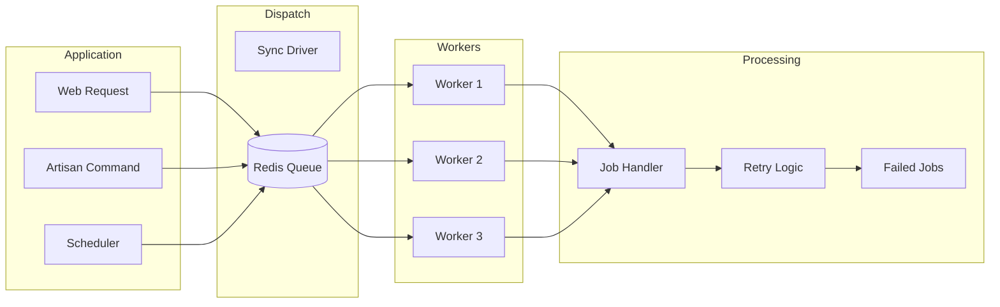

# Queue & Background Jobs Guide

Standards for implementing queued jobs and background processing in the Agency Platform.

---

## Architecture Overview



---

## Queue Configuration

### Redis Setup

```php
// config/queue.php
return [
    'default' => env('QUEUE_CONNECTION', 'redis'),

    'connections' => [
        'redis' => [
            'driver' => 'redis',
            'connection' => 'default',
            'queue' => env('REDIS_QUEUE', 'default'),
            'retry_after' => 90,
            'block_for' => 5,
            'after_commit' => true,  // Dispatch after DB commit
        ],
    ],

    'batching' => [
        'database' => env('DB_CONNECTION', 'mysql'),
        'table' => 'job_batches',
    ],

    'failed' => [
        'driver' => env('QUEUE_FAILED_DRIVER', 'database-uuids'),
        'database' => env('DB_CONNECTION', 'mysql'),
        'table' => 'failed_jobs',
    ],
];
```

### Queue Priority

```php
// High priority (payments, notifications)
php artisan queue:work --queue=high,default,low

// Queue names by priority
'high'    => Critical business operations (payments, webhooks)
'default' => Standard operations (emails, reports)
'low'     => Background tasks (cleanup, analytics)
```

---

## Job Structure

### Standard Job Class

```php
<?php

declare(strict_types=1);

namespace App\Jobs;

use App\Models\Invoice;
use App\Notifications\InvoiceSent;
use App\Services\PdfGenerator;
use Illuminate\Bus\Queueable;
use Illuminate\Contracts\Queue\ShouldBeUnique;
use Illuminate\Contracts\Queue\ShouldQueue;
use Illuminate\Foundation\Bus\Dispatchable;
use Illuminate\Queue\InteractsWithQueue;
use Illuminate\Queue\Middleware\WithoutOverlapping;
use Illuminate\Queue\SerializesModels;
use Illuminate\Support\Facades\Log;
use Throwable;

/**
 * Sends invoice email to client with PDF attachment.
 *
 * @package App\Jobs
 */
final class SendInvoiceEmail implements ShouldQueue, ShouldBeUnique
{
    use Dispatchable, InteractsWithQueue, Queueable, SerializesModels;

    /**
     * Number of times the job may be attempted.
     */
    public int $tries = 3;

    /**
     * Number of seconds to wait before retrying.
     */
    public int $backoff = 60;

    /**
     * Maximum seconds job can run.
     */
    public int $timeout = 120;

    /**
     * Number of seconds job remains unique.
     */
    public int $uniqueFor = 3600;

    public function __construct(
        public Invoice $invoice,
        public bool $attachPdf = true
    ) {
        $this->onQueue('default');
    }

    /**
     * Get the unique ID for the job.
     */
    public function uniqueId(): string
    {
        return 'send-invoice-' . $this->invoice->id;
    }

    /**
     * Get the middleware the job should pass through.
     *
     * @return array<int, object>
     */
    public function middleware(): array
    {
        return [
            new WithoutOverlapping($this->invoice->id),
        ];
    }

    /**
     * Execute the job.
     */
    public function handle(PdfGenerator $pdfGenerator): void
    {
        Log::info('Sending invoice email', [
            'invoice_id' => $this->invoice->id,
            'client_email' => $this->invoice->client->email,
        ]);

        // Generate PDF if needed
        $pdfPath = null;
        if ($this->attachPdf) {
            $pdfPath = $pdfGenerator->generateInvoice($this->invoice);
        }

        // Send notification
        $this->invoice->client->notify(
            new InvoiceSent($this->invoice, $pdfPath)
        );

        // Update invoice status
        $this->invoice->update([
            'sent_at' => now(),
            'status' => 'sent',
        ]);

        Log::info('Invoice email sent', [
            'invoice_id' => $this->invoice->id,
        ]);
    }

    /**
     * Handle job failure.
     */
    public function failed(Throwable $exception): void
    {
        Log::error('Invoice email failed', [
            'invoice_id' => $this->invoice->id,
            'error' => $exception->getMessage(),
            'attempts' => $this->attempts(),
        ]);

        // Mark invoice as failed
        $this->invoice->update(['email_failed_at' => now()]);

        // Notify admin
        // Notification::send(User::admins(), new JobFailed($this, $exception));
    }

    /**
     * Determine when to stop retrying.
     */
    public function retryUntil(): \DateTime
    {
        return now()->addHours(24);
    }

    /**
     * Get tags for monitoring.
     *
     * @return array<int, string>
     */
    public function tags(): array
    {
        return [
            'invoice',
            'email',
            'invoice:' . $this->invoice->id,
            'client:' . $this->invoice->client_id,
        ];
    }
}
```

---

## Dispatching Jobs

### Basic Dispatch

```php
// Dispatch to default queue
SendInvoiceEmail::dispatch($invoice);

// Dispatch to specific queue
SendInvoiceEmail::dispatch($invoice)->onQueue('high');

// Dispatch with delay
SendInvoiceEmail::dispatch($invoice)->delay(now()->addMinutes(5));

// Dispatch after response sent
SendInvoiceEmail::dispatchAfterResponse($invoice);

// Dispatch synchronously (for testing)
SendInvoiceEmail::dispatchSync($invoice);
```

### Conditional Dispatch

```php
// Dispatch if condition
SendInvoiceEmail::dispatchIf($invoice->shouldSendEmail(), $invoice);

// Dispatch unless condition
SendInvoiceEmail::dispatchUnless($invoice->wasRecentlySent(), $invoice);
```

### Chained Jobs

```php
use Illuminate\Support\Facades\Bus;

Bus::chain([
    new GenerateInvoicePdf($invoice),
    new SendInvoiceEmail($invoice),
    new UpdateAnalytics($invoice),
])->onQueue('default')
  ->dispatch();

// With catch
Bus::chain([
    new ProcessPayment($invoice),
    new SendReceipt($invoice),
])->catch(function (Throwable $e) use ($invoice) {
    // Handle chain failure
    $invoice->markPaymentFailed();
})->dispatch();
```

### Job Batches

```php
use Illuminate\Bus\Batch;
use Illuminate\Support\Facades\Bus;

$batch = Bus::batch([
    new SendInvoiceEmail($invoice1),
    new SendInvoiceEmail($invoice2),
    new SendInvoiceEmail($invoice3),
])->then(function (Batch $batch) {
    // All jobs completed successfully
    Log::info('Batch completed', ['id' => $batch->id]);
})->catch(function (Batch $batch, Throwable $e) {
    // First batch job failure
    Log::error('Batch failed', ['id' => $batch->id]);
})->finally(function (Batch $batch) {
    // Batch finished (success or failure)
})->name('Send Monthly Invoices')
  ->allowFailures()
  ->onQueue('default')
  ->dispatch();

// Track batch progress
$batch = Bus::findBatch($batchId);
echo $batch->progress(); // 0-100
echo $batch->pendingJobs;
echo $batch->failedJobs;
```

---

## Scheduled Jobs

### Scheduler Configuration

```php
// routes/console.php (Laravel 11)
<?php

use Illuminate\Support\Facades\Schedule;

// Daily tasks
Schedule::command('invoices:send-reminders')
    ->dailyAt('09:00')
    ->withoutOverlapping()
    ->onOneServer()
    ->emailOutputOnFailure('alerts@agency-platform.com');

Schedule::command('reports:generate-daily')
    ->dailyAt('06:00')
    ->runInBackground();

// Weekly tasks
Schedule::command('cleanup:old-files')
    ->weekly()
    ->sundays()
    ->at('03:00');

// Hourly tasks
Schedule::command('sync:external-data')
    ->hourly()
    ->between('06:00', '22:00');

// Every minute (for time-sensitive)
Schedule::command('queue:monitor')
    ->everyMinute()
    ->runInBackground();

// Custom frequency
Schedule::job(new GenerateAnalytics)
    ->everyFifteenMinutes()
    ->when(fn () => app()->environment('production'));
```

### Artisan Command for Scheduled Tasks

```php
<?php

declare(strict_types=1);

namespace App\Console\Commands;

use App\Models\Invoice;
use App\Notifications\InvoiceReminder;
use Illuminate\Console\Command;

final class SendInvoiceReminders extends Command
{
    protected $signature = 'invoices:send-reminders
                            {--dry-run : Show what would be sent without sending}';

    protected $description = 'Send payment reminders for overdue invoices';

    public function handle(): int
    {
        $overdueInvoices = Invoice::query()
            ->where('status', 'sent')
            ->where('due_date', '<', now())
            ->whereNull('reminder_sent_at')
            ->with('client')
            ->get();

        if ($overdueInvoices->isEmpty()) {
            $this->info('No overdue invoices found.');
            return self::SUCCESS;
        }

        $this->info("Found {$overdueInvoices->count()} overdue invoices.");

        $bar = $this->output->createProgressBar($overdueInvoices->count());

        foreach ($overdueInvoices as $invoice) {
            $this->line("Processing invoice {$invoice->number}...");

            if (! $this->option('dry-run')) {
                $invoice->client->notify(new InvoiceReminder($invoice));
                $invoice->update(['reminder_sent_at' => now()]);
            }

            $bar->advance();
        }

        $bar->finish();
        $this->newLine();
        $this->info('Reminders sent successfully.');

        return self::SUCCESS;
    }
}
```

---

## Job Middleware

### Rate Limiting

```php
use Illuminate\Queue\Middleware\RateLimited;
use Illuminate\Support\Facades\RateLimiter;

// Define rate limiter (in AppServiceProvider)
RateLimiter::for('emails', function (object $job) {
    return Limit::perMinute(30);
});

// Use in job
public function middleware(): array
{
    return [
        new RateLimited('emails'),
    ];
}
```

### Without Overlapping

```php
use Illuminate\Queue\Middleware\WithoutOverlapping;

public function middleware(): array
{
    return [
        // Prevent concurrent jobs for same invoice
        (new WithoutOverlapping($this->invoice->id))
            ->releaseAfter(60)  // Release lock after 60 seconds
            ->dontRelease(),    // Don't release, let job fail
    ];
}
```

### Skip When Already Running

```php
use Illuminate\Queue\Middleware\Skip;

public function middleware(): array
{
    return [
        Skip::when(fn () => $this->invoice->wasRecentlySent()),
    ];
}
```

### Custom Middleware

```php
// app/Jobs/Middleware/EnsureActiveSubscription.php
<?php

declare(strict_types=1);

namespace App\Jobs\Middleware;

use Closure;

final class EnsureActiveSubscription
{
    public function handle(object $job, Closure $next): void
    {
        if ($job->user->hasActiveSubscription()) {
            $next($job);
        } else {
            // Skip job silently
            $job->delete();
        }
    }
}
```

---

## Error Handling & Retries

### Retry Configuration

```php
// Fixed retry attempts
public int $tries = 3;

// Exponential backoff
public function backoff(): array
{
    return [60, 300, 900]; // 1 min, 5 min, 15 min
}

// Retry until time
public function retryUntil(): DateTime
{
    return now()->addHours(24);
}
```

### Handling Specific Exceptions

```php
use App\Exceptions\External\StripeException;
use Illuminate\Queue\Middleware\ThrottlesExceptionsWithRedis;

public function middleware(): array
{
    return [
        // Throttle on Stripe rate limits
        (new ThrottlesExceptionsWithRedis(10, 5))
            ->by('stripe')
            ->when(fn ($e) => $e instanceof StripeException),
    ];
}

public function handle(): void
{
    try {
        // Process payment
    } catch (StripeException $e) {
        if ($e->isRateLimited()) {
            // Release back to queue with delay
            $this->release(60);
            return;
        }

        if ($e->isUnrecoverable()) {
            // Fail immediately, don't retry
            $this->fail($e);
            return;
        }

        throw $e; // Let normal retry logic handle
    }
}
```

### Manual Release

```php
public function handle(): void
{
    if (! $this->invoice->isReady()) {
        // Put back on queue with delay
        $this->release(300); // 5 minutes
        return;
    }

    // Process job
}
```

---

## Monitoring with Horizon

### Installation

```bash
composer require laravel/horizon
php artisan horizon:install
```

### Configuration

```php
// config/horizon.php
return [
    'environments' => [
        'production' => [
            'supervisor-1' => [
                'connection' => 'redis',
                'queue' => ['high', 'default', 'low'],
                'balance' => 'auto',
                'minProcesses' => 1,
                'maxProcesses' => 10,
                'balanceMaxShift' => 1,
                'balanceCooldown' => 3,
                'tries' => 3,
                'timeout' => 60,
            ],
        ],
        'local' => [
            'supervisor-1' => [
                'connection' => 'redis',
                'queue' => ['high', 'default', 'low'],
                'balance' => 'simple',
                'processes' => 3,
                'tries' => 3,
            ],
        ],
    ],
];
```

### Horizon Metrics

```php
// Check queue health
use Laravel\Horizon\Contracts\MetricsRepository;

$metrics = app(MetricsRepository::class);
$throughput = $metrics->throughputForQueue('default');
$runtime = $metrics->runtimeForQueue('default');
$failRate = $metrics->failedJobsPerMinute();
```

---

## Common Job Patterns

### Idempotent Jobs

```php
// Ensure job can be safely retried
public function handle(): void
{
    // Check if already processed
    if ($this->invoice->sent_at !== null) {
        Log::info('Invoice already sent, skipping', ['id' => $this->invoice->id]);
        return;
    }

    // Use database transactions
    DB::transaction(function () {
        $this->invoice->update(['sent_at' => now()]);
        $this->sendEmail();
    });
}
```

### Long-Running Jobs with Progress

```php
public function handle(): void
{
    $items = $this->getItemsToProcess();
    $total = $items->count();

    foreach ($items as $index => $item) {
        $this->processItem($item);

        // Update progress (for Horizon UI)
        $this->job->setProgress(($index + 1) / $total * 100);

        // Heartbeat to prevent timeout
        if ($index % 100 === 0) {
            $this->job->touch();
        }
    }
}
```

### Jobs with External API Calls

```php
public function handle(): void
{
    // Wrap external calls with retry logic
    retry(3, function () {
        return Http::timeout(10)
            ->post('https://api.service.com/data', $this->payload);
    }, 100); // 100ms between retries
}
```

---

## Testing Jobs

### Basic Job Tests

```php
use App\Jobs\SendInvoiceEmail;
use Illuminate\Support\Facades\Queue;

test('dispatches invoice email job', function () {
    Queue::fake();

    $invoice = Invoice::factory()->create();

    SendInvoiceEmail::dispatch($invoice);

    Queue::assertPushed(SendInvoiceEmail::class, function ($job) use ($invoice) {
        return $job->invoice->id === $invoice->id;
    });
});

test('dispatches on correct queue', function () {
    Queue::fake();

    SendInvoiceEmail::dispatch($invoice)->onQueue('high');

    Queue::assertPushedOn('high', SendInvoiceEmail::class);
});
```

### Testing Job Execution

```php
test('sends invoice email', function () {
    Notification::fake();

    $invoice = Invoice::factory()->create();

    (new SendInvoiceEmail($invoice))->handle(app(PdfGenerator::class));

    Notification::assertSentTo($invoice->client, InvoiceSent::class);
    expect($invoice->fresh()->sent_at)->not->toBeNull();
});

test('marks invoice as failed on error', function () {
    Mail::shouldReceive('send')->andThrow(new Exception('Mail failed'));

    $invoice = Invoice::factory()->create();
    $job = new SendInvoiceEmail($invoice);

    try {
        $job->handle(app(PdfGenerator::class));
    } catch (Exception $e) {
        $job->failed($e);
    }

    expect($invoice->fresh()->email_failed_at)->not->toBeNull();
});
```

### Testing Batches

```php
test('processes invoice batch', function () {
    Bus::fake();

    $invoices = Invoice::factory(5)->create();

    Bus::batch(
        $invoices->map(fn ($i) => new SendInvoiceEmail($i))->all()
    )->dispatch();

    Bus::assertBatched(function (PendingBatch $batch) {
        return $batch->jobs->count() === 5;
    });
});
```

---

## Related Documentation

- [Exception Handling](./exception-handling.md) - Error handling
- [Development Standards](./dev-standards.md) - Code standards
- [CI/CD Pipeline](../07-operations/ci-cd-pipeline.md) - Deployment
- [Monitoring Guide](../07-operations/monitoring-guide.md) - Observability

---

## Change Log

| Date | Version | Author | Change Description |
|------|---------|--------|-------------------|
| 2025-11-30 | 1.0.0 | Claude | Initial queue jobs guide |
