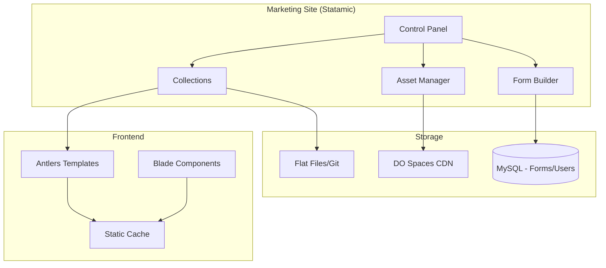

# Statamic 5 CMS Integration Guide

Configuration and development standards for Statamic 5 CMS powering the Agency Platform marketing site.

---

## Architecture Overview



---

## Installation & Configuration

### Initial Setup

```bash
# Install Statamic
composer require statamic/cms

# Publish Statamic assets
php artisan statamic:install

# Create admin user
php artisan statamic:make:user
```

### Configuration Files

```php
// config/statamic/system.php
return [
    'license_key' => env('STATAMIC_LICENSE_KEY'),
    'multisite' => false,
    'locales' => [
        'default' => 'en_US',
    ],
];

// config/statamic/cp.php
return [
    'route' => 'admin/cms',  // Separate from Filament /admin
    'start_page' => 'collections/pages',
    'date_format' => 'Y-m-d',
    'pagination_size' => 50,
];

// config/statamic/stache.php (flat-file cache)
return [
    'watcher' => env('STATAMIC_STACHE_WATCHER', true),
    'stores' => [
        'collections' => [
            'class' => \Statamic\Stache\Stores\CollectionsStore::class,
            'directory' => base_path('content/collections'),
        ],
    ],
];

// config/statamic/static_caching.php
return [
    'strategy' => 'half',  // 'full' for production
    'expiry' => 60 * 24,   // 24 hours
    'invalidation' => [
        'rules' => 'all',
    ],
];
```

---

## Content Structure

### Directory Layout

```
content/
├── collections/
│   ├── pages/
│   │   ├── home.md
│   │   ├── about.md
│   │   ├── services.md
│   │   └── contact.md
│   ├── posts/
│   │   ├── 2025-01-15.welcome-to-our-blog.md
│   │   └── 2025-01-20.project-showcase.md
│   ├── projects/      # Portfolio projects
│   │   ├── project-alpha.md
│   │   └── project-beta.md
│   ├── team/
│   │   ├── jane-doe.md
│   │   └── john-smith.md
│   └── testimonials/
│       └── client-feedback.md
├── globals/
│   ├── site.yaml
│   ├── seo.yaml
│   └── social.yaml
├── taxonomies/
│   ├── categories/
│   └── tags/
└── trees/
    └── navigation/
        └── main.yaml
```

### Collection Configuration

```yaml
# content/collections/pages.yaml
title: Pages
route: '/{slug}'
layout: layouts.marketing
template: pages.show
blueprints:
  - page
  - landing_page
sort_dir: asc
date_behavior:
  past: public
  future: unlisted
revisions: true
inject:
  seo_title: '{{ title }} | Agency Platform'

# content/collections/posts.yaml
title: Blog Posts
route: '/blog/{slug}'
layout: layouts.marketing
template: posts.show
blueprints:
  - post
sort_by: date
sort_dir: desc
date: true
past_date_behavior: public
future_date_behavior: private
revisions: true
taxonomies:
  - categories
  - tags
```

---

## Blueprints (Content Models)

### Page Blueprint

```yaml
# resources/blueprints/collections/pages/page.yaml
title: Page
tabs:
  main:
    display: Content
    sections:
      -
        fields:
          -
            handle: title
            field:
              type: text
              required: true
              validate:
                - required

          -
            handle: hero_image
            field:
              type: assets
              container: images
              max_files: 1
              mode: grid

          -
            handle: content
            field:
              type: bard
              buttons:
                - h2
                - h3
                - bold
                - italic
                - unorderedlist
                - orderedlist
                - quote
                - link
                - image
                - table
              sets:
                cta_block:
                  display: CTA Block
                  fields:
                    -
                      handle: heading
                      field:
                        type: text
                    -
                      handle: button_text
                      field:
                        type: text
                    -
                      handle: button_url
                      field:
                        type: link

          -
            handle: page_builder
            field:
              type: replicator
              sets:
                hero:
                  display: Hero Section
                  fields:
                    - handle: headline
                      field: { type: text }
                    - handle: subheadline
                      field: { type: textarea }
                    - handle: cta_button
                      field: { type: link }

                features:
                  display: Features Grid
                  fields:
                    - handle: features
                      field:
                        type: grid
                        fields:
                          - handle: icon
                            field: { type: text }
                          - handle: title
                            field: { type: text }
                          - handle: description
                            field: { type: textarea }

                testimonial:
                  display: Testimonial
                  fields:
                    - handle: quote
                      field: { type: textarea }
                    - handle: author
                      field: { type: text }
                    - handle: company
                      field: { type: text }

  seo:
    display: SEO
    sections:
      -
        fields:
          -
            handle: meta_title
            field:
              type: text
              character_limit: 60

          -
            handle: meta_description
            field:
              type: textarea
              character_limit: 160

          -
            handle: og_image
            field:
              type: assets
              container: images
              max_files: 1

  settings:
    display: Settings
    sections:
      -
        fields:
          -
            handle: template
            field:
              type: template
              hide_partials: true

          -
            handle: published
            field:
              type: toggle
              default: true
```

### Blog Post Blueprint

```yaml
# resources/blueprints/collections/posts/post.yaml
title: Blog Post
tabs:
  main:
    display: Content
    sections:
      -
        fields:
          -
            handle: title
            field:
              type: text
              required: true

          -
            handle: featured_image
            field:
              type: assets
              container: images
              max_files: 1
              required: true

          -
            handle: excerpt
            field:
              type: textarea
              character_limit: 200

          -
            handle: content
            field:
              type: bard
              save_html: false
              buttons:
                - h2
                - h3
                - bold
                - italic
                - unorderedlist
                - orderedlist
                - quote
                - link
                - image
                - code

          -
            handle: author
            field:
              type: users
              max_items: 1
              mode: default

  taxonomy:
    display: Taxonomy
    sections:
      -
        fields:
          -
            handle: categories
            field:
              type: terms
              taxonomies:
                - categories
              mode: select

          -
            handle: tags
            field:
              type: terms
              taxonomies:
                - tags
              mode: tags
```

---

## Asset Management

### Container Configuration

```yaml
# content/assets/images.yaml
title: Images
disk: spaces
path: marketing
url: https://cdn.agency-platform.com/marketing
allow_uploads: true
allow_downloading: true
allow_renaming: true
allow_moving: true
create_folders: true
search_index: true
```

### Image Transformations

```php
// config/statamic/assets.php
return [
    'image_manipulation' => [
        'driver' => 'imagick',  // or 'gd'
        'cache' => true,
        'cache_path' => storage_path('statamic/glide'),
    ],
    'presets' => [
        'thumbnail' => ['w' => 300, 'h' => 200, 'fit' => 'crop'],
        'hero' => ['w' => 1920, 'h' => 600, 'fit' => 'crop'],
        'card' => ['w' => 600, 'h' => 400, 'fit' => 'crop'],
        'og' => ['w' => 1200, 'h' => 630, 'fit' => 'crop'],
    ],
];
```

```antlers
{{# In templates #}}
{{ featured_image }}
    
{{ /featured_image }}

{{# Using presets #}}

```

---

## Antlers Templates

### Layout Structure

```antlers
{{# resources/views/layouts/marketing.antlers.html #}}
<!DOCTYPE html>
<html lang="{{ site:locale }}">
<head>
    <meta charset="UTF-8">
    <meta name="viewport" content="width=device-width, initial-scale=1.0">

    {{# SEO Meta #}}
    <title>{{ meta_title ?? title }} | {{ site:name }}</title>
    <meta name="description" content="{{ meta_description ?? excerpt }}">

    {{# Open Graph #}}
    <meta property="og:title" content="{{ meta_title ?? title }}">
    <meta property="og:description" content="{{ meta_description ?? excerpt }}">
    {{ if og_image }}
        <meta property="og:image" content="{{ glide:og_image preset="og" absolute="true" }}">
    {{ /if }}

    {{# Styles #}}
    @vite(['resources/css/marketing.css', 'resources/js/marketing.js'])

    {{ yield:head }}
</head>
<body class="font-sans antialiased">
    {{ partial:navigation/header }}

    <main>
        {{ template_content }}
    </main>

    {{ partial:navigation/footer }}

    {{ yield:scripts }}
</body>
</html>
```

### Page Template

```antlers
{{# resources/views/pages/show.antlers.html #}}
{{ if hero_image }}
    <section class="hero">
        
        <h1>{{ title }}</h1>
    </section>
{{ /if }}

<article class="prose max-w-4xl mx-auto py-12">
    {{ content }}
</article>

{{# Page Builder Sections #}}
{{ page_builder }}
    {{ partial src="blocks/{type}" }}
{{ /page_builder }}
```

### Partials

```antlers
{{# resources/views/partials/blocks/hero.antlers.html #}}
<section class="bg-gradient-to-r from-blue-600 to-blue-800 text-white py-24">
    <div class="container mx-auto px-4 text-center">
        <h1 class="text-5xl font-bold mb-6">{{ headline }}</h1>
        <p class="text-xl mb-8">{{ subheadline }}</p>
        {{ if cta_button }}
            <a href="{{ cta_button }}" class="btn btn-white">
                {{ cta_button:text }}
            </a>
        {{ /if }}
    </div>
</section>

{{# resources/views/partials/blocks/features.antlers.html #}}
<section class="py-16">
    <div class="container mx-auto px-4">
        <div class="grid md:grid-cols-3 gap-8">
            {{ features }}
                <div class="text-center">
                    <div class="text-4xl mb-4">{{ icon }}</div>
                    <h3 class="text-xl font-semibold mb-2">{{ title }}</h3>
                    <p class="text-gray-600">{{ description }}</p>
                </div>
            {{ /features }}
        </div>
    </div>
</section>
```

### Blog Listing

```antlers
{{# resources/views/posts/index.antlers.html #}}
<div class="container mx-auto py-12">
    <h1 class="text-4xl font-bold mb-8">Blog</h1>

    {{# Category Filter #}}
    <div class="flex gap-4 mb-8">
        <a href="{{ url }}" class="{{ if ! get:category }}font-bold{{ /if }}">All</a>
        {{ taxonomy:categories }}
            <a
                href="{{ url }}?category={{ slug }}"
                class="{{ if get:category == slug }}font-bold{{ /if }}"
            >
                {{ title }}
            </a>
        {{ /taxonomy:categories }}
    </div>

    {{# Posts Grid #}}
    <div class="grid md:grid-cols-3 gap-8">
        {{ collection:posts
            :category:is="get:category"
            limit="12"
            paginate="true"
        }}
            <article class="card">
                {{ if featured_image }}
                    
                {{ /if }}
                <div class="p-6">
                    <time datetime="{{ date format="Y-m-d" }}">
                        {{ date format="F j, Y" }}
                    </time>
                    <h2 class="text-xl font-semibold mt-2">
                        <a href="{{ url }}">{{ title }}</a>
                    </h2>
                    <p class="text-gray-600 mt-2">{{ excerpt }}</p>
                </div>
            </article>

            {{ if no_results }}
                <p>No posts found.</p>
            {{ /if }}
        {{ /collection:posts }}
    </div>

    {{# Pagination #}}
    {{ paginate }}
        <nav class="flex justify-center gap-2 mt-12">
            {{ if prev_page }}
                <a href="{{ prev_page }}">&larr; Previous</a>
            {{ /if }}

            {{ links }}
                <a
                    href="{{ url }}"
                    class="{{ if is_current }}font-bold{{ /if }}"
                >
                    {{ page }}
                </a>
            {{ /links }}

            {{ if next_page }}
                <a href="{{ next_page }}">Next &rarr;</a>
            {{ /if }}
        </nav>
    {{ /paginate }}
</div>
```

---

## Forms

### Contact Form Configuration

```yaml
# resources/forms/contact.yaml
title: Contact Form
honeypot: fax_number
store: true
email:
  -
    to: 'hello@agency-platform.com'
    from: '{{ email }}'
    reply_to: '{{ email }}'
    subject: 'New Contact Form Submission'
    html: emails.contact
    text: emails.contact-text
```

### Form Blueprint

```yaml
# resources/blueprints/forms/contact.yaml
title: Contact
fields:
  -
    handle: name
    field:
      type: text
      display: Name
      validate:
        - required

  -
    handle: email
    field:
      type: text
      display: Email
      input_type: email
      validate:
        - required
        - email

  -
    handle: company
    field:
      type: text
      display: Company

  -
    handle: message
    field:
      type: textarea
      display: Message
      validate:
        - required
        - min:20
```

### Form Template

```antlers
{{ form:contact }}
    {{ if errors }}
        <div class="alert alert-error">
            <ul>
                {{ errors }}
                    <li>{{ value }}</li>
                {{ /errors }}
            </ul>
        </div>
    {{ /if }}

    {{ if success }}
        <div class="alert alert-success">
            Thank you for your message! We'll be in touch soon.
        </div>
    {{ else }}
        <div class="grid gap-4">
            <div>
                <label for="name">Name *</label>
                <input
                    type="text"
                    name="name"
                    id="name"
                    value="{{ old:name }}"
                    required
                >
                {{ if error:name }}<span class="error">{{ error:name }}</span>{{ /if }}
            </div>

            <div>
                <label for="email">Email *</label>
                <input
                    type="email"
                    name="email"
                    id="email"
                    value="{{ old:email }}"
                    required
                >
                {{ if error:email }}<span class="error">{{ error:email }}</span>{{ /if }}
            </div>

            <div>
                <label for="company">Company</label>
                <input
                    type="text"
                    name="company"
                    id="company"
                    value="{{ old:company }}"
                >
            </div>

            <div>
                <label for="message">Message *</label>
                <textarea
                    name="message"
                    id="message"
                    rows="5"
                    required
                >{{ old:message }}</textarea>
                {{ if error:message }}<span class="error">{{ error:message }}</span>{{ /if }}
            </div>

            {{# Honeypot #}}
            <div style="display: none;">
                <input type="text" name="fax_number">
            </div>

            <button type="submit" class="btn btn-primary">Send Message</button>
        </div>
    {{ /if }}
{{ /form:contact }}
```

---

## Static Caching

### Full Static Caching (Production)

```php
// config/statamic/static_caching.php
return [
    'strategy' => 'full',
    'expiry' => null,  // Never expire, invalidate on save
    'invalidation' => [
        'class' => \Statamic\StaticCaching\Invalidators\DefaultInvalidator::class,
        'rules' => 'all',
    ],
    'exclude' => [
        '/admin/*',
        '/api/*',
        '/portal/*',
    ],
];
```

### Cache Invalidation

```php
// app/Listeners/InvalidateStaticCache.php
namespace App\Listeners;

use Statamic\Events\EntrySaved;
use Statamic\StaticCaching\Cacher;

final class InvalidateStaticCache
{
    public function __construct(
        private Cacher $cacher
    ) {}

    public function handle(EntrySaved $event): void
    {
        // Invalidate specific URL
        $this->cacher->invalidateUrl($event->entry->url());

        // Invalidate related pages
        if ($event->entry->collection()->handle() === 'posts') {
            $this->cacher->invalidateUrl('/blog');
        }
    }
}
```

---

## SEO Configuration

### Global SEO Settings

```yaml
# content/globals/seo.yaml
title: SEO Settings
data:
  site_name: Agency Platform
  site_description: Full-service digital agency building amazing web experiences.
  default_og_image: assets/og-default.jpg
  twitter_handle: '@agencyplatform'
  google_analytics_id: G-XXXXXXXXXX
```

### SEO Tags Partial

```antlers
{{# resources/views/partials/seo.antlers.html #}}
<title>{{ meta_title ?? title }} | {{ seo:site_name }}</title>
<meta name="description" content="{{ meta_description ?? excerpt ?? seo:site_description }}">

{{# Canonical #}}
<link rel="canonical" href="{{ current_url }}">

{{# Open Graph #}}
<meta property="og:type" content="{{ if collection:handle == 'posts' }}article{{ else }}website{{ /if }}">
<meta property="og:title" content="{{ meta_title ?? title }}">
<meta property="og:description" content="{{ meta_description ?? excerpt ?? seo:site_description }}">
<meta property="og:url" content="{{ current_url }}">
<meta property="og:site_name" content="{{ seo:site_name }}">
{{ if og_image ?? featured_image ?? seo:default_og_image }}
    <meta property="og:image" content="{{ glide:og_image ?? glide:featured_image ?? glide:seo:default_og_image preset="og" absolute="true" }}">
{{ /if }}

{{# Twitter #}}
<meta name="twitter:card" content="summary_large_image">
<meta name="twitter:site" content="{{ seo:twitter_handle }}">
<meta name="twitter:title" content="{{ meta_title ?? title }}">
<meta name="twitter:description" content="{{ meta_description ?? excerpt ?? seo:site_description }}">

{{# Article Meta #}}
{{ if collection:handle == 'posts' }}
    <meta property="article:published_time" content="{{ date format="c" }}">
    {{ if updated_at }}<meta property="article:modified_time" content="{{ updated_at format="c" }}">{{ /if }}
    {{ author }}<meta property="article:author" content="{{ name }}">{{ /author }}
{{ /if }}

{{# JSON-LD Schema #}}
<script type="application/ld+json">
{
    "@context": "https://schema.org",
    "@type": "{{ if collection:handle == 'posts' }}BlogPosting{{ else }}WebPage{{ /if }}",
    "headline": "{{ title | entities }}",
    "description": "{{ meta_description ?? excerpt | entities }}",
    "url": "{{ current_url }}",
    {{ if featured_image }}
    "image": "{{ glide:featured_image preset="og" absolute="true" }}",
    {{ /if }}
    "publisher": {
        "@type": "Organization",
        "name": "{{ seo:site_name | entities }}"
    }
}
</script>
```

---

## Navigation

### Navigation Structure

```yaml
# content/trees/navigation/main.yaml
tree:
  -
    id: home
    title: Home
    url: /
  -
    id: services
    title: Services
    url: /services
  -
    id: portfolio
    title: Portfolio
    url: /portfolio
  -
    id: blog
    title: Blog
    url: /blog
  -
    id: about
    title: About
    url: /about
  -
    id: contact
    title: Contact
    url: /contact
```

### Navigation Template

```antlers
{{# resources/views/partials/navigation/header.antlers.html #}}
<header class="bg-white shadow">
    <nav class="container mx-auto px-4 py-4 flex justify-between items-center">
        <a href="/" class="text-xl font-bold">
            {{ seo:site_name }}
        </a>

        <ul class="hidden md:flex gap-6">
            {{ nav:main }}
                <li>
                    <a
                        href="{{ url }}"
                        class="{{ if is_current || is_parent }}text-blue-600 font-semibold{{ else }}text-gray-700 hover:text-blue-600{{ /if }}"
                    >
                        {{ title }}
                    </a>

                    {{ if children }}
                        <ul class="submenu">
                            {{ children }}
                                <li><a href="{{ url }}">{{ title }}</a></li>
                            {{ /children }}
                        </ul>
                    {{ /if }}
                </li>
            {{ /nav:main }}
        </ul>

        {{# Mobile Menu Toggle #}}
        <button class="md:hidden" x-data @click="$dispatch('toggle-menu')">
            <svg class="w-6 h-6"><!-- Menu icon --></svg>
        </button>
    </nav>
</header>
```

---

## Integration with Laravel

### Shared Authentication

```php
// config/statamic/users.php
return [
    'repository' => 'eloquent',  // Use Laravel's User model
    'eloquent' => [
        'model' => \App\Models\User::class,
    ],
    'avatars' => 'gravatar',
    'new_user_roles' => ['content_editor'],
];
```

### API Endpoints

```php
// routes/api.php
use Statamic\Facades\Entry;

Route::get('/api/posts', function () {
    return Entry::query()
        ->where('collection', 'posts')
        ->where('status', 'published')
        ->orderBy('date', 'desc')
        ->limit(10)
        ->get()
        ->map(fn ($entry) => [
            'id' => $entry->id(),
            'title' => $entry->title,
            'slug' => $entry->slug(),
            'excerpt' => $entry->excerpt,
            'date' => $entry->date()->format('Y-m-d'),
            'url' => $entry->url(),
        ]);
});
```

### Sharing Data with Livewire

```php
// In Livewire component
use Statamic\Facades\GlobalSet;

public function mount(): void
{
    $this->siteSettings = GlobalSet::findByHandle('site')->inCurrentSite()->toArray();
}
```

---

## Deployment Considerations

### Git-Based Content

```yaml
# .github/workflows/deploy.yml
- name: Deploy content changes
  run: |
    # Content is in Git, deploy with code
    php artisan statamic:stache:warm
    php artisan statamic:static:clear
    php artisan statamic:static:warm
```

### Environment Variables

```env
STATAMIC_LICENSE_KEY=your-license-key
STATAMIC_STACHE_WATCHER=false  # Disable in production
STATAMIC_STATIC_CACHING_STRATEGY=full
STATAMIC_PRO_ENABLED=true
```

---

## Related Documentation

- [ADR-0003: CMS Solution](../03-decisions/adr-0003-cms-solution.md) - Why Statamic
- [Development Standards](./dev-standards.md) - General standards
- [Asset Configuration](./file-handling.md) - DO Spaces setup
- [SEO Requirements](../01-requirements/req-mktg-001.md) - SEO specs

---

## Change Log

| Date | Version | Author | Change Description |
|------|---------|--------|-------------------|
| 2025-11-30 | 1.0.0 | Claude | Initial Statamic 5 guide |
