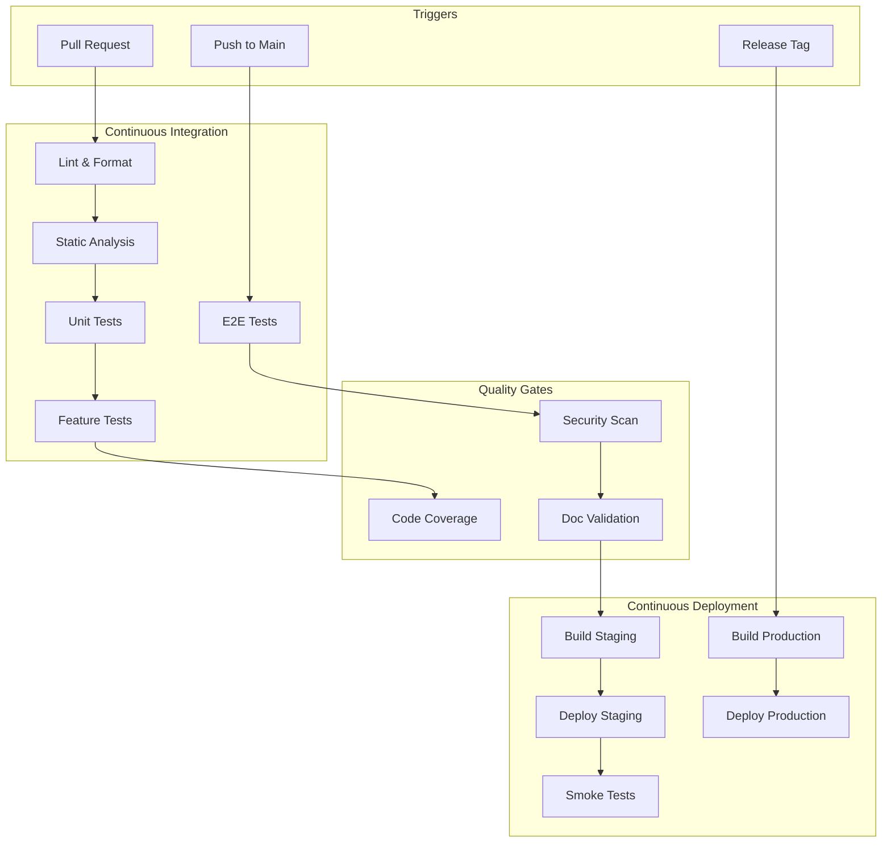

# CI/CD Pipeline Documentation

Complete guide to the continuous integration and deployment pipeline.

---

## Pipeline Architecture



---

## GitHub Actions Workflows

### Main Quality Workflow

```yaml
# .github/workflows/quality.yml
name: Quality Gate

on:
  pull_request:
    branches: [main, develop]
  push:
    branches: [main]

concurrency:
  group: ${{ github.workflow }}-${{ github.ref }}
  cancel-in-progress: true

env:
  PHP_VERSION: '8.3'
  NODE_VERSION: '20'

jobs:
  # ============================================
  # LINTING & FORMATTING
  # ============================================
  lint:
    name: Lint & Format
    runs-on: ubuntu-latest

    steps:
      - uses: actions/checkout@v4

      - name: Setup PHP
        uses: shivammathur/setup-php@v2
        with:
          php-version: ${{ env.PHP_VERSION }}
          extensions: mbstring, dom, fileinfo
          tools: composer:v2

      - name: Cache Composer
        uses: actions/cache@v4
        with:
          path: vendor
          key: ${{ runner.os }}-composer-${{ hashFiles('composer.lock') }}
          restore-keys: ${{ runner.os }}-composer-

      - name: Install Dependencies
        run: composer install --no-interaction --prefer-dist

      - name: Laravel Pint (PHP Style)
        run: ./vendor/bin/pint --test

      - name: Setup Node
        uses: actions/setup-node@v4
        with:
          node-version: ${{ env.NODE_VERSION }}
          cache: 'npm'

      - name: Install Node Dependencies
        run: npm ci

      - name: ESLint
        run: npm run lint

      - name: Prettier
        run: npm run format:check

  # ============================================
  # STATIC ANALYSIS
  # ============================================
  static-analysis:
    name: Static Analysis
    runs-on: ubuntu-latest

    steps:
      - uses: actions/checkout@v4

      - name: Setup PHP
        uses: shivammathur/setup-php@v2
        with:
          php-version: ${{ env.PHP_VERSION }}
          extensions: mbstring, dom, fileinfo
          tools: composer:v2

      - name: Cache Composer
        uses: actions/cache@v4
        with:
          path: vendor
          key: ${{ runner.os }}-composer-${{ hashFiles('composer.lock') }}

      - name: Install Dependencies
        run: composer install --no-interaction --prefer-dist

      - name: PHPStan
        run: ./vendor/bin/phpstan analyse --memory-limit=2G

      - name: Larastan
        run: ./vendor/bin/phpstan analyse --configuration=phpstan-laravel.neon

  # ============================================
  # SECURITY SCANNING
  # ============================================
  security:
    name: Security Scan
    runs-on: ubuntu-latest

    steps:
      - uses: actions/checkout@v4

      - name: Setup PHP
        uses: shivammathur/setup-php@v2
        with:
          php-version: ${{ env.PHP_VERSION }}

      - name: Composer Audit
        run: composer audit

      - name: NPM Audit
        run: npm audit --audit-level=high

      - name: Secret Scanning
        uses: trufflesecurity/trufflehog@main
        with:
          extra_args: --only-verified

  # ============================================
  # UNIT & FEATURE TESTS
  # ============================================
  tests:
    name: Tests (PHP ${{ matrix.php }})
    runs-on: ubuntu-latest
    needs: [lint, static-analysis]

    strategy:
      fail-fast: false
      matrix:
        php: ['8.2', '8.3']

    services:
      mysql:
        image: mysql:8.0
        env:
          MYSQL_ROOT_PASSWORD: password
          MYSQL_DATABASE: testing
        ports:
          - 3306:3306
        options: >-
          --health-cmd="mysqladmin ping"
          --health-interval=10s
          --health-timeout=5s
          --health-retries=3

      redis:
        image: redis:7
        ports:
          - 6379:6379
        options: >-
          --health-cmd="redis-cli ping"
          --health-interval=10s
          --health-timeout=5s
          --health-retries=3

    steps:
      - uses: actions/checkout@v4

      - name: Setup PHP
        uses: shivammathur/setup-php@v2
        with:
          php-version: ${{ matrix.php }}
          extensions: mbstring, dom, fileinfo, mysql, redis
          coverage: xdebug
          tools: composer:v2

      - name: Cache Composer
        uses: actions/cache@v4
        with:
          path: vendor
          key: ${{ runner.os }}-php${{ matrix.php }}-composer-${{ hashFiles('composer.lock') }}

      - name: Install Dependencies
        run: composer install --no-interaction --prefer-dist

      - name: Setup Application
        run: |
          cp .env.testing .env
          php artisan key:generate
          php artisan config:cache

      - name: Run Migrations
        run: php artisan migrate --force
        env:
          DB_CONNECTION: mysql
          DB_HOST: 127.0.0.1
          DB_PORT: 3306
          DB_DATABASE: testing
          DB_USERNAME: root
          DB_PASSWORD: password

      - name: Run Tests
        run: |
          php artisan test --parallel --coverage-clover=coverage.xml
        env:
          DB_CONNECTION: mysql
          DB_HOST: 127.0.0.1
          DB_PORT: 3306
          DB_DATABASE: testing
          DB_USERNAME: root
          DB_PASSWORD: password
          REDIS_HOST: 127.0.0.1
          REDIS_PORT: 6379

      - name: Upload Coverage
        uses: codecov/codecov-action@v4
        with:
          files: coverage.xml
          flags: php-${{ matrix.php }}
          fail_ci_if_error: false

  # ============================================
  # DOCUMENTATION VALIDATION
  # ============================================
  docs:
    name: Documentation Quality
    runs-on: ubuntu-latest
    if: contains(github.event.pull_request.changed_files, 'docs/')

    steps:
      - uses: actions/checkout@v4

      - name: Setup Node
        uses: actions/setup-node@v4
        with:
          node-version: ${{ env.NODE_VERSION }}

      - name: Install Dependencies
        run: npm ci

      - name: Validate Frontmatter
        run: |
          find docs -name "*.md" -exec grep -l "^---" {} \; | while read file; do
            if ! head -1 "$file" | grep -q "^---"; then
              echo "Missing frontmatter: $file"
              exit 1
            fi
          done

      - name: Check Internal Links
        run: |
          npm run docs:check-links || true

      - name: Lint Markdown
        uses: DavidAnson/markdownlint-cli2-action@v14
        with:
          globs: 'docs/**/*.md'

  # ============================================
  # BUILD ASSETS
  # ============================================
  build:
    name: Build Assets
    runs-on: ubuntu-latest
    needs: tests
    if: github.ref == 'refs/heads/main'

    steps:
      - uses: actions/checkout@v4

      - name: Setup Node
        uses: actions/setup-node@v4
        with:
          node-version: ${{ env.NODE_VERSION }}
          cache: 'npm'

      - name: Install Dependencies
        run: npm ci

      - name: Build Assets
        run: npm run build

      - name: Upload Artifacts
        uses: actions/upload-artifact@v4
        with:
          name: build-assets
          path: public/build/
          retention-days: 7
```

### Deployment Workflow

```yaml
# .github/workflows/deploy.yml
name: Deploy

on:
  workflow_run:
    workflows: ["Quality Gate"]
    branches: [main]
    types: [completed]

  release:
    types: [published]

concurrency:
  group: deploy-${{ github.ref }}
  cancel-in-progress: false

jobs:
  # ============================================
  # DEPLOY STAGING
  # ============================================
  deploy-staging:
    name: Deploy to Staging
    runs-on: ubuntu-latest
    if: github.event.workflow_run.conclusion == 'success'
    environment:
      name: staging
      url: https://staging.agency-platform.com

    steps:
      - uses: actions/checkout@v4

      - name: Download Build Artifacts
        uses: actions/download-artifact@v4
        with:
          name: build-assets
          path: public/build/

      - name: Deploy to Staging
        run: |
          curl -X POST ${{ secrets.FORGE_DEPLOY_STAGING_URL }}

      - name: Wait for Deployment
        run: sleep 60

      - name: Smoke Tests
        run: |
          curl -f https://staging.agency-platform.com/health || exit 1
          curl -f https://staging.agency-platform.com/api/health || exit 1

      - name: Notify Slack
        if: always()
        uses: 8398a7/action-slack@v3
        with:
          status: ${{ job.status }}
          text: 'Staging deployment ${{ job.status }}'
        env:
          SLACK_WEBHOOK_URL: ${{ secrets.SLACK_WEBHOOK }}

  # ============================================
  # DEPLOY PRODUCTION
  # ============================================
  deploy-production:
    name: Deploy to Production
    runs-on: ubuntu-latest
    needs: deploy-staging
    if: github.event_name == 'release'
    environment:
      name: production
      url: https://agency-platform.com

    steps:
      - uses: actions/checkout@v4

      - name: Pre-deployment Backup
        run: |
          curl -X POST ${{ secrets.FORGE_BACKUP_URL }}

      - name: Deploy to Production
        run: |
          curl -X POST ${{ secrets.FORGE_DEPLOY_PRODUCTION_URL }}

      - name: Wait for Deployment
        run: sleep 90

      - name: Health Check
        run: |
          for i in {1..5}; do
            curl -f https://agency-platform.com/health && break
            sleep 10
          done

      - name: Verify Critical Endpoints
        run: |
          curl -f https://agency-platform.com/ || exit 1
          curl -f https://agency-platform.com/api/health || exit 1

      - name: Tag Deployment in Sentry
        run: |
          curl -sL https://sentry.io/api/0/organizations/${{ secrets.SENTRY_ORG }}/releases/ \
            -H "Authorization: Bearer ${{ secrets.SENTRY_AUTH_TOKEN }}" \
            -H "Content-Type: application/json" \
            -d '{
              "version": "${{ github.ref_name }}",
              "projects": ["agency-platform"]
            }'

      - name: Notify Team
        if: always()
        uses: 8398a7/action-slack@v3
        with:
          status: ${{ job.status }}
          text: 'Production deployment ${{ github.ref_name }} - ${{ job.status }}'
        env:
          SLACK_WEBHOOK_URL: ${{ secrets.SLACK_WEBHOOK }}
```

---

## Quality Gates

### Required Checks for PR Merge

| Check | Threshold | Blocking |
|-------|-----------|----------|
| Lint & Format | Pass | Yes |
| Static Analysis (PHPStan) | Level 8, 0 errors | Yes |
| Unit Tests | 100% pass | Yes |
| Feature Tests | 100% pass | Yes |
| Code Coverage | ≥80% | Yes |
| Security Scan | 0 high/critical | Yes |
| Documentation | Valid frontmatter | No |

### Branch Protection Rules

```yaml
# Required for main branch
protection_rules:
  require_status_checks: true
  required_status_checks:
    - "Tests (PHP 8.3)"
    - "Lint & Format"
    - "Static Analysis"
    - "Security Scan"
  require_pull_request_reviews: true
  required_approving_review_count: 1
  dismiss_stale_reviews: true
  require_code_owner_reviews: true
  require_linear_history: true
```

---

## Environment Configuration

### GitHub Secrets

```
# Required Secrets
FORGE_DEPLOY_STAGING_URL    # Forge deployment webhook
FORGE_DEPLOY_PRODUCTION_URL # Forge deployment webhook
FORGE_BACKUP_URL            # Backup trigger webhook

SENTRY_AUTH_TOKEN           # Sentry release tracking
SENTRY_ORG                  # Sentry organization slug

SLACK_WEBHOOK               # Slack notifications

CODECOV_TOKEN               # Coverage reporting

# Optional Secrets
BROWSERSTACK_USERNAME       # E2E testing
BROWSERSTACK_ACCESS_KEY     # E2E testing
```

### Environment Variables

```yaml
# Per-environment settings
staging:
  APP_ENV: staging
  APP_DEBUG: false
  LOG_LEVEL: debug
  CACHE_DRIVER: redis
  QUEUE_CONNECTION: redis

production:
  APP_ENV: production
  APP_DEBUG: false
  LOG_LEVEL: error
  CACHE_DRIVER: redis
  QUEUE_CONNECTION: redis
```

---

## Rollback Procedures

### Automatic Rollback

```yaml
# In deploy workflow
- name: Health Check
  id: health
  continue-on-error: true
  run: |
    for i in {1..5}; do
      curl -f ${{ env.APP_URL }}/health && exit 0
      sleep 10
    done
    exit 1

- name: Rollback on Failure
  if: steps.health.outcome == 'failure'
  run: |
    curl -X POST ${{ secrets.FORGE_ROLLBACK_URL }}
    echo "::error::Deployment failed, rolled back"
    exit 1
```

### Manual Rollback

```bash
# Via Forge CLI
forge deploy:rollback agency-platform

# Via SSH
ssh forge@server
cd /home/forge/agency-platform
git checkout HEAD~1
php artisan migrate:rollback --step=1
php artisan config:cache
php artisan route:cache
php artisan view:cache
sudo supervisorctl restart all
```

---

## Monitoring Deployments

### Health Check Endpoint

```php
// routes/api.php
Route::get('/health', function () {
    $checks = [
        'database' => rescue(fn () => DB::connection()->getPdo() !== null, false),
        'cache' => rescue(fn () => Cache::set('health', true, 1), false),
        'queue' => rescue(fn () => Queue::size('default') >= 0, false),
        'storage' => rescue(fn () => Storage::exists('.gitignore'), false),
    ];

    $healthy = ! in_array(false, $checks, true);

    return response()->json([
        'status' => $healthy ? 'healthy' : 'unhealthy',
        'checks' => $checks,
        'version' => config('app.version'),
        'timestamp' => now()->toIso8601String(),
    ], $healthy ? 200 : 503);
});
```

### Deployment Notifications

```php
// app/Listeners/NotifyDeployment.php
class NotifyDeployment
{
    public function handle(DeploymentCompleted $event): void
    {
        Notification::route('slack', config('services.slack.deployments'))
            ->notify(new DeploymentNotification($event->version, $event->environment));
    }
}
```

---

## Local Development CI

### Pre-commit Hooks

```bash
# .husky/pre-commit
#!/bin/sh
. "$(dirname "$0")/_/husky.sh"

# PHP formatting
./vendor/bin/pint --dirty

# JS/TS formatting
npm run lint-staged

# Check for debug statements
grep -rn "dd(" app/ --include="*.php" && exit 1 || true
grep -rn "console.log" resources/js/ --include="*.ts" && exit 1 || true
```

### Makefile Commands

```makefile
# Makefile
.PHONY: ci test lint analyse

ci: lint analyse test ## Run full CI locally

lint: ## Run linters
	./vendor/bin/pint
	npm run lint

analyse: ## Run static analysis
	./vendor/bin/phpstan analyse

test: ## Run tests
	php artisan test --parallel

test-coverage: ## Run tests with coverage
	php artisan test --coverage --min=80

deploy-staging: ## Deploy to staging
	gh workflow run deploy.yml -f environment=staging

deploy-production: ## Deploy to production
	@read -p "Are you sure? [y/N] " confirm && [ "$$confirm" = "y" ]
	gh workflow run deploy.yml -f environment=production
```

---

## Related Documentation

- [Quality Gates SOP](../00-governance/sop-002-quality-gates.md) - Quality standards
- [Git Standards](../00-governance/sop-001-git-standards.md) - Git workflow
- [Deployment Runbook](./runbook-deployment.md) - Deployment procedures
- [Testing Strategy](../06-testing/testing-strategy.md) - Test approach

---

## Change Log

| Date | Version | Author | Change Description |
|------|---------|--------|-------------------|
| 2025-11-30 | 1.0.0 | Claude | Initial CI/CD pipeline documentation |
