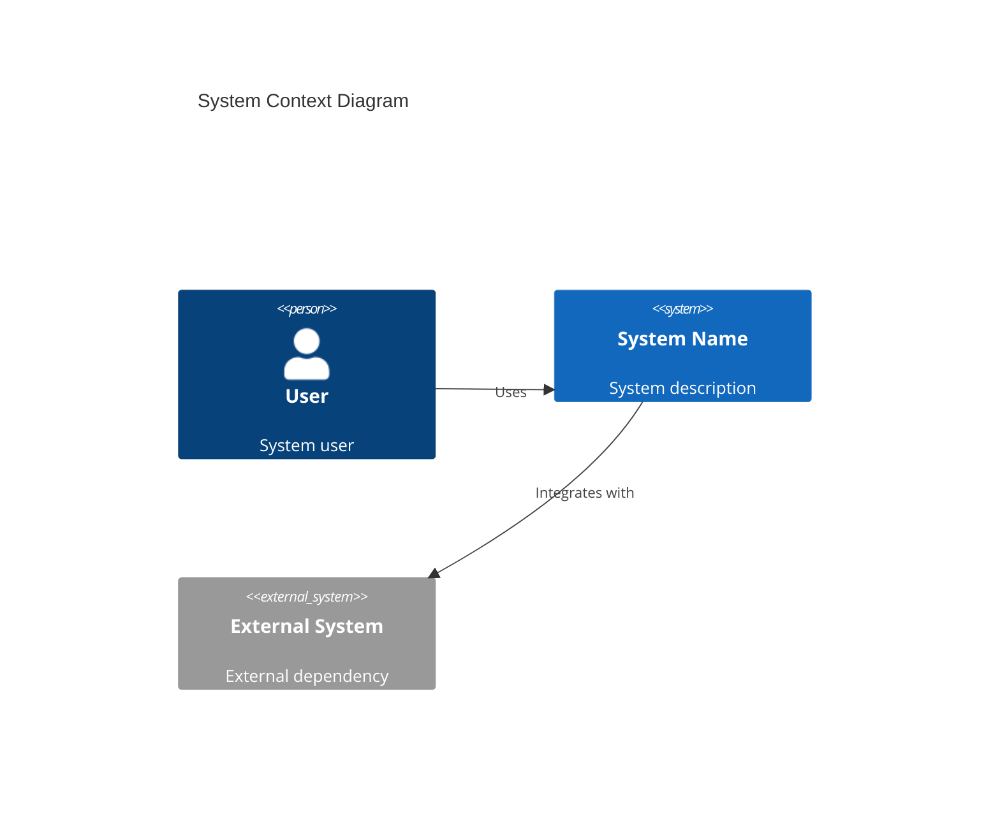
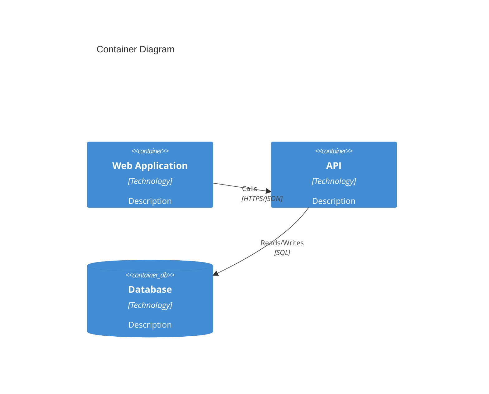
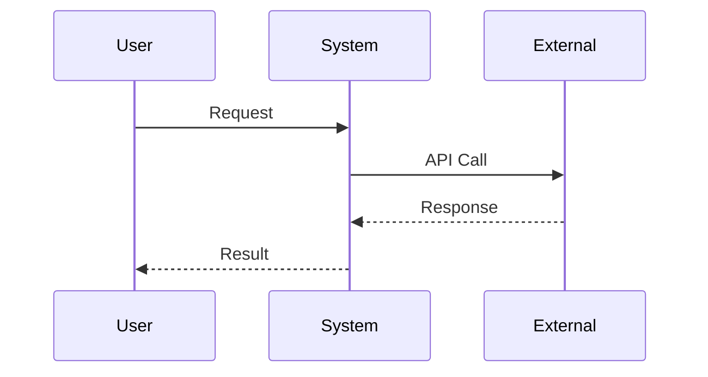
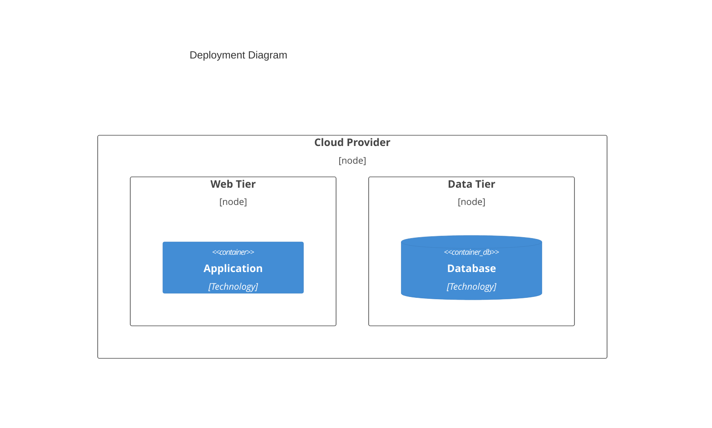

# [System Name] Architecture

Architecture documentation following the arc42 template.

---

## 1. Introduction and Goals

### 1.1 Requirements Overview

[Brief summary of key functional requirements this architecture addresses]

| ID | Requirement | Priority |
|----|-------------|----------|
| REQ-XXX-001 | [Requirement] | Critical |
| REQ-XXX-002 | [Requirement] | High |

### 1.2 Quality Goals

| Priority | Quality Goal | Scenario |
|----------|--------------|----------|
| 1 | [Goal, e.g., Performance] | [Measurable scenario] |
| 2 | [Goal, e.g., Security] | [Measurable scenario] |
| 3 | [Goal, e.g., Scalability] | [Measurable scenario] |

### 1.3 Stakeholders

| Role | Name | Expectations |
|------|------|--------------|
| [Role] | [Name/Team] | [Key expectations] |

---

## 2. Constraints

### 2.1 Technical Constraints

| Constraint | Description |
|------------|-------------|
| [Constraint] | [Description and rationale] |

### 2.2 Organizational Constraints

| Constraint | Description |
|------------|-------------|
| [Constraint] | [Description and rationale] |

### 2.3 Conventions

| Convention | Description |
|------------|-------------|
| [Convention] | [Description] |

---

## 3. System Scope and Context

### 3.1 Business Context



| Actor/System | Description | Interface |
|--------------|-------------|-----------|
| [Actor] | [Description] | [Interface type] |

### 3.2 Technical Context



---

## 4. Solution Strategy

### 4.1 Technology Decisions

| Decision | Rationale | ADR |
|----------|-----------|-----|
| [Technology choice] | [Why chosen] | [ADR-NNNN] |

### 4.2 Top-Level Decomposition

[Describe the high-level approach to decomposing the system]

### 4.3 Quality Approaches

| Quality Goal | Approach |
|--------------|----------|
| [Goal] | [How addressed] |

---

## 5. Building Block View

### 5.1 Level 1: System Overview

```mermaid
C4Container
    title Building Blocks - Level 1
```

| Block | Responsibility | Interface |
|-------|----------------|-----------|
| [Block] | [Responsibility] | [Interface] |

### 5.2 Level 2: [Subsystem Name]

[Decompose major building blocks]

### 5.3 Level 3: [Component Name]

[Decompose critical components if needed]

---

## 6. Runtime View

### 6.1 [Scenario Name]



[Description of the scenario]

---

## 7. Deployment View

### 7.1 Infrastructure



### 7.2 Environment Mapping

| Environment | Infrastructure | Purpose |
|-------------|----------------|---------|
| Production | [Details] | Live system |
| Staging | [Details] | Pre-production testing |
| Development | [Details] | Development |

---

## 8. Cross-Cutting Concepts

### 8.1 Domain Model

[Key domain entities and relationships]

### 8.2 Security Concept

[Authentication, authorization, encryption approach]

### 8.3 Error Handling

[Error handling strategy]

### 8.4 Logging and Monitoring

[Logging and monitoring approach]

---

## 9. Architecture Decisions

[Reference to key ADRs]

| ADR | Decision | Status |
|-----|----------|--------|
| [ADR-NNNN](../03-decisions/adr-nnnn.md) | [Decision] | Accepted |

---

## 10. Quality Requirements

### 10.1 Quality Tree

```
Quality
├── Performance
│   ├── Response Time
│   └── Throughput
├── Security
│   ├── Authentication
│   └── Authorization
└── Maintainability
    ├── Modularity
    └── Testability
```

### 10.2 Quality Scenarios

| ID | Scenario | Metric | Target |
|----|----------|--------|--------|
| QS-1 | [Scenario] | [Metric] | [Target] |

---

## 11. Risks and Technical Debt

### 11.1 Risks

| Risk | Probability | Impact | Mitigation |
|------|-------------|--------|------------|
| [Risk] | [H/M/L] | [H/M/L] | [Strategy] |

### 11.2 Technical Debt

| Item | Description | Priority |
|------|-------------|----------|
| [Debt item] | [Description] | [Priority] |

---

## 12. Glossary

| Term | Definition |
|------|------------|
| [Term] | [Definition] |

---

## Change Log

| Date | Version | Author | Change Description |
|------|---------|--------|-------------------|
| YYYY-MM-DD | 1.0.0 | [Author] | Initial architecture document |
