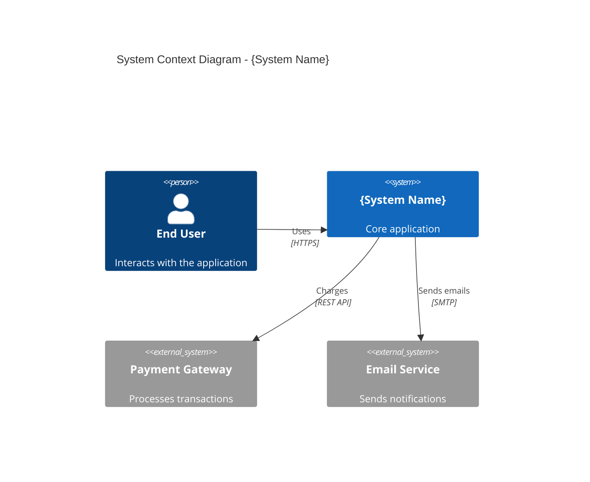
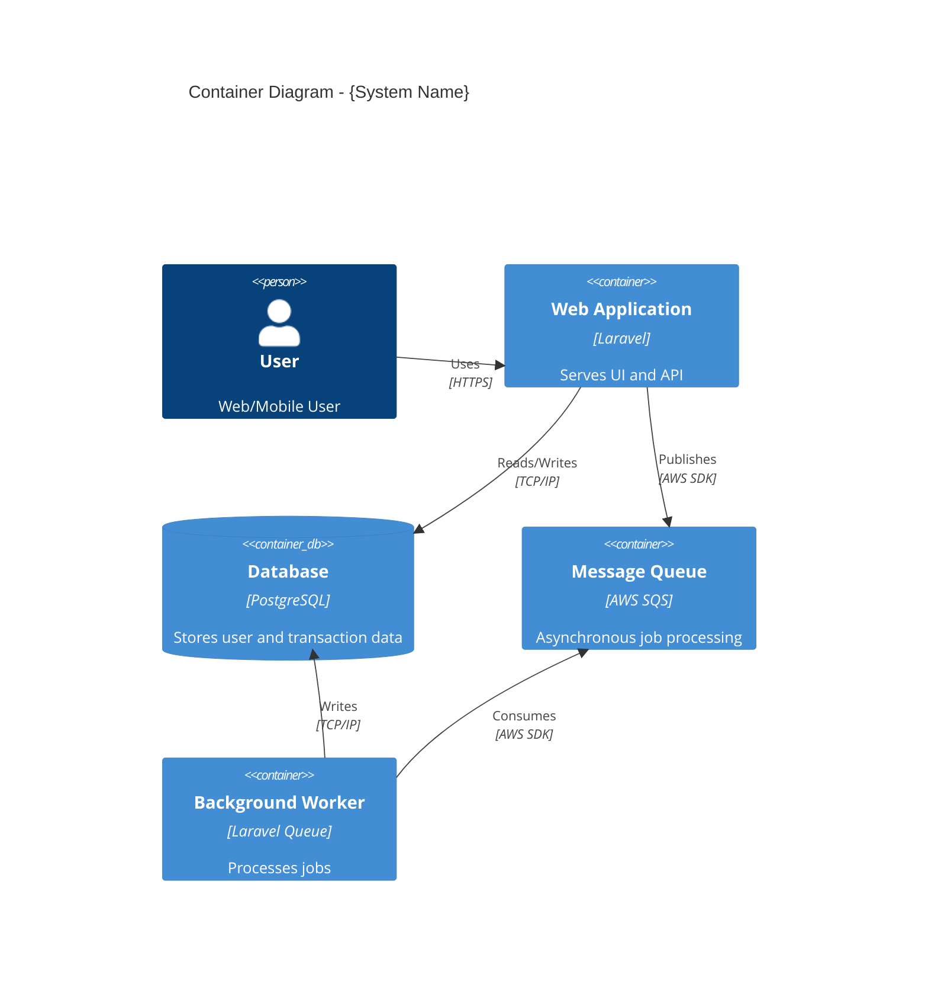
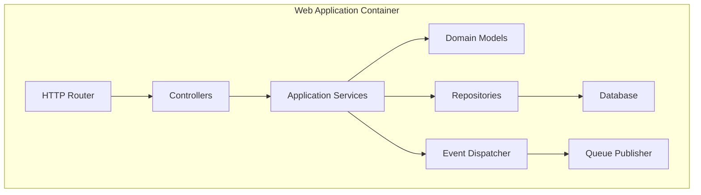
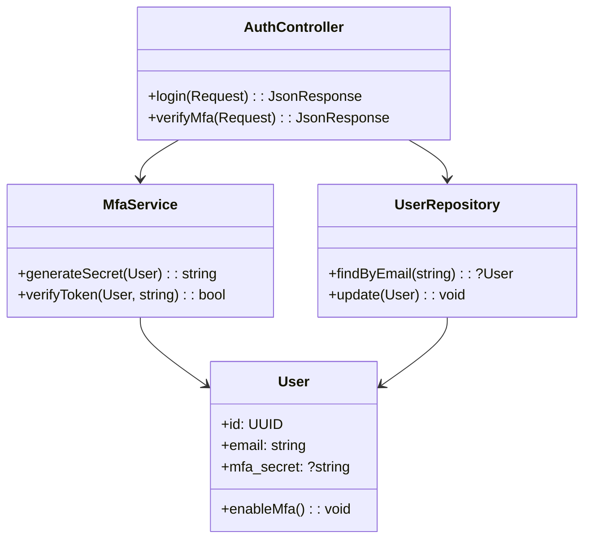
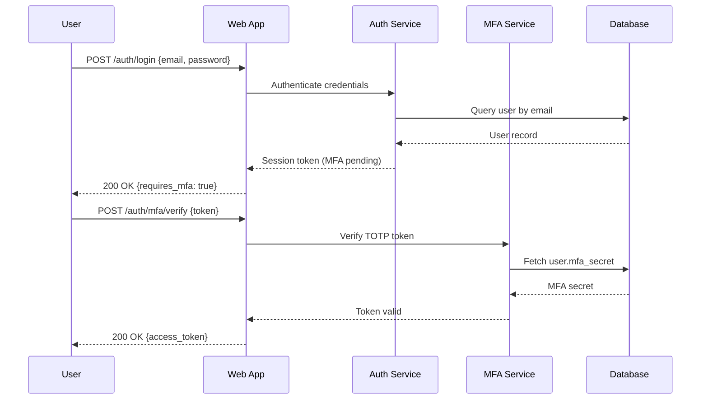
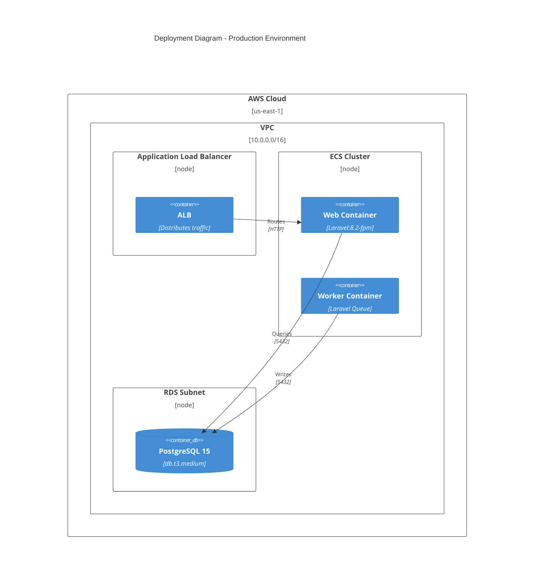

# Architecture Specification: {System Name}

**Template Version:** arc42 v8.0
**System:** {System Name}
**Version:** {v1.0.0}
**Last Updated:** YYYY-MM-DD

---

## 1. Introduction and Goals

### 1.1 Requirements Overview

Summarize the key requirements driving this architecture. Link to requirement documents.

**Example:**
- [REQ-USER-101](../01-requirements/req-user-101.md): User authentication and authorization
- [REQ-DATA-042](../01-requirements/req-data-042.md): Real-time data synchronization

### 1.2 Quality Goals

| Priority | Quality Attribute | Specific Goal |
|----------|-------------------|---------------|
| 1        | Performance       | 95th percentile API response time < 200ms |
| 2        | Availability      | 99.9% uptime (43 minutes downtime/month max) |
| 3        | Security          | Zero high-severity vulnerabilities in production |

### 1.3 Stakeholders

| Role               | Contact        | Expectations                          |
|--------------------|----------------|---------------------------------------|
| Product Owner      | Jane Doe       | Feature delivery timeline clarity     |
| Lead Engineer      | John Smith     | Technical feasibility and maintainability |
| Security Officer   | Alex Johnson   | Compliance with security policies     |

---

## 2. Architecture Constraints

### 2.1 Technical Constraints

| Constraint | Description | Impact |
|------------|-------------|--------|
| Cloud Provider | AWS (company standard) | Must use AWS services for hosting |
| Programming Language | PHP 8.2+, Laravel 11 | Team expertise and existing codebase |
| Database | PostgreSQL 15+ | ACID compliance requirement |

### 2.2 Organizational Constraints

| Constraint | Description |
|------------|-------------|
| Budget     | Infrastructure costs capped at $5,000/month |
| Timeline   | MVP delivery required within 12 weeks |
| Team Size  | 4 engineers (2 backend, 1 frontend, 1 DevOps) |

### 2.3 Conventions

- **API Design:** Follow [SOP-004](../00-governance/sop-004-api-guidelines.md) (Zalando guidelines)
- **Code Style:** PSR-12 (enforced via PHP-CS-Fixer)
- **Documentation:** All architecture decisions require ADRs

---

## 3. System Scope and Context

### 3.1 Business Context



**External Entities:**
- **Payment Gateway:** Stripe API (PCI DSS compliant)
- **Email Service:** SendGrid (transactional emails)
- **Analytics:** Google Analytics (user behavior tracking)

### 3.2 Technical Context

| Interface | Protocol | Data Format | Authentication |
|-----------|----------|-------------|----------------|
| Client API | HTTPS | JSON | Bearer Token (JWT) |
| Payment Gateway | HTTPS | JSON | API Key |
| Email Service | SMTP/TLS | MIME | API Key |

---

## 4. Solution Strategy

### 4.1 Technology Decisions

| Decision | Rationale | Reference |
|----------|-----------|-----------|
| Laravel Framework | Team expertise, rapid development | ADR-0001 |
| PostgreSQL Database | ACID compliance, JSON support | ADR-0012 |
| AWS ECS (Fargate) | Managed containers, auto-scaling | ADR-0023 |

### 4.2 Architecture Patterns

- **Layered Architecture:** Presentation → Application → Domain → Infrastructure
- **Repository Pattern:** Abstract data access for testability
- **Event-Driven Communication:** Asynchronous processing via SQS

---

## 5. Building Block View

### 5.1 Level 1: System Decomposition



**Containers:**
- **Web Application:** Laravel monolith (API + Blade views)
- **Database:** PostgreSQL (RDS managed instance)
- **Message Queue:** AWS SQS (decouples synchronous operations)
- **Background Worker:** Laravel Queue worker (processes emails, exports)

### 5.2 Level 2: Component View (Web Application)



**Components:**
- **Controllers:** HTTP request handlers (thin layer)
- **Application Services:** Business logic orchestration
- **Domain Models:** Eloquent models with business rules
- **Repositories:** Data access abstraction
- **Event Dispatcher:** Publishes domain events

**Key Architectural Decision:**
[ADR-0034](../03-decisions/adr-0034.md) - Adopt Repository Pattern for Data Access

### 5.3 Level 3: Class View (Authentication Module)

**Implements:** [ADR-0008](../03-decisions/adr-0008.md) (TOTP-based MFA)



---

## 6. Runtime View

### 6.1 Scenario: User Login with MFA



**Implements:** [REQ-AUTH-101](../01-requirements/req-auth-101.md)

---

## 7. Deployment View

### 7.1 Production Environment (AWS)



**Infrastructure:**
- **Compute:** ECS Fargate (2 tasks, 1 vCPU / 2GB RAM each)
- **Database:** RDS PostgreSQL (db.t3.medium, Multi-AZ)
- **Load Balancer:** Application Load Balancer (TLS termination)
- **Storage:** S3 (file uploads, backups)

---

## 8. Cross-Cutting Concepts

### 8.1 Domain Model

*(Describe core domain entities and relationships)*

### 8.2 Security

- **Authentication:** JWT tokens (15-minute expiry, refresh tokens)
- **Authorization:** Laravel Policies (role-based access control)
- **Encryption:** AES-256 for sensitive data at rest (Laravel Encryption)
- **TLS:** Enforce HTTPS (redirect HTTP → HTTPS via ALB)

**Reference:** [ADR-0015](../03-decisions/adr-0015.md) - JWT Token Strategy

### 8.3 Monitoring and Observability

- **Logging:** CloudWatch Logs (structured JSON logs)
- **Metrics:** CloudWatch Metrics (request count, latency, error rate)
- **Tracing:** AWS X-Ray (distributed tracing)
- **Alerting:** PagerDuty integration (error rate > 5%)

### 8.4 Error Handling

- **Client Errors (4xx):** Return RFC 7807 Problem Details JSON
- **Server Errors (5xx):** Log stack trace, return generic message to client
- **Retries:** Exponential backoff for external API calls (max 3 attempts)

---

## 9. Architecture Decisions

| ADR | Title | Status |
|-----|-------|--------|
| [ADR-0001](../03-decisions/adr-0001.md) | Adopt Laravel Framework | Accepted |
| [ADR-0008](../03-decisions/adr-0008.md) | TOTP-based MFA Provider | Accepted |
| [ADR-0012](../03-decisions/adr-0012.md) | PostgreSQL Database Selection | Accepted |
| [ADR-0023](../03-decisions/adr-0023.md) | ECS Deployment Strategy | Accepted |
| [ADR-0034](../03-decisions/adr-0034.md) | Repository Pattern | Accepted |

---

## 10. Quality Requirements

### 10.1 Quality Scenarios

| Scenario ID | Quality Attribute | Scenario |
|-------------|-------------------|----------|
| QA-1        | Performance       | Under normal load (100 req/sec), API response time < 200ms |
| QA-2        | Scalability       | System scales to 500 concurrent users without degradation |
| QA-3        | Security          | Penetration test reveals zero critical vulnerabilities |
| QA-4        | Maintainability   | New feature implementation time < 2 weeks (average) |

### 10.2 Quality Tree

```
Quality
├── Performance
│   ├── Response Time (< 200ms)
│   └── Throughput (> 1000 req/sec)
├── Reliability
│   ├── Availability (99.9%)
│   └── Data Integrity (ACID compliance)
└── Security
    ├── Authentication (MFA for admins)
    └── Encryption (TLS + AES-256)
```

---

## 11. Risks and Technical Debt

### 11.1 Identified Risks

| Risk | Probability | Impact | Mitigation |
|------|-------------|--------|------------|
| Database performance bottleneck | Medium | High | Implement read replicas (ADR-0045) |
| Third-party API downtime (Stripe) | Low | High | Circuit breaker pattern, retry logic |
| Team lacks Kubernetes experience | High | Medium | Use ECS Fargate (managed orchestration) |

### 11.2 Technical Debt

| Debt Item | Impact | Plan |
|-----------|--------|------|
| Monolithic architecture limits scalability | Medium | Evaluate microservices (Q2 2026) |
| Manual database migrations | Low | Automate via CI/CD (ADR-0056) |

---

## 12. Glossary

| Term | Definition |
|------|------------|
| ADR  | Architectural Decision Record |
| TOTP | Time-Based One-Time Password (RFC 6238) |
| MFA  | Multi-Factor Authentication |
| ECS  | Elastic Container Service (AWS) |
| RDS  | Relational Database Service (AWS) |
| ACID | Atomicity, Consistency, Isolation, Durability |

---

## References

- [SOP-000: Golden Thread](../00-governance/sop-000-master.md)
- [SOP-004: API Guidelines](../00-governance/sop-004-api-guidelines.md)
- [arc42 Template Guide](https://arc42.org/overview)
- [C4 Model Documentation](https://c4model.com)
